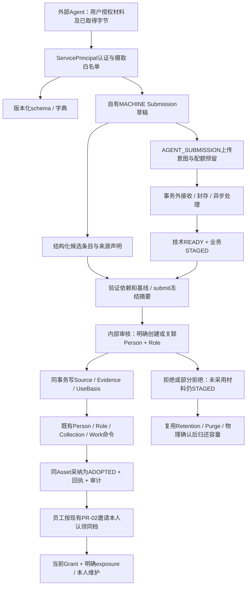

# PR-04：External Agent Ingestion / 外部 Agent 受控建档摄取

日期：2026-10-02。状态：**DESIGN_ONLY / 待复核，未编码**。依据冻结的 [spec/15 §11、PR-04](../spec/15_TALENT_EXPERIENCE_V1_1.md)、[spec/16 ADR](../spec/16_TALENT_EXPERIENCE_CONTRACT.md) 和 [PR-03冻结记录](../release/PR03_DEVELOPMENT_FREEZE.md)。代码核对基线：`aeaf49da7d5346785adac6df4e2d34321f9d92d2`，PR #31 Ready、未合并、未部署。

本文细化已确定的摄取范围，供开发前复核。以下实体增量、权限名、API路径和错误码均为**拟实现合同**；不是已运行接口，不回写PR-03业务代码或验收合同。设计通过后仍须另获开发授权；若PR #31尚未合并，不把PR-04代码追加到它的冻结分支。

## 1. 第一性原理：接收材料，不授予材料提供者裁决权

系统需要接收外部工具已取得的资料，并让内部人员把有依据的部分写入同一份人物档案。Agent掌握材料，不因此掌握人物身份、维护授权或正式事实的最终决定权。

因此必须分清五件事：

| 问题 | 系统中的依据 | 不能替代它的东西 |
|---|---|---|
| 谁提交 | 当前ServicePrincipal，MACHINE真实归因 | 责任员工身份、浏览器管理员Cookie |
| 交给谁审核 | 服务端确定的机器scope和内部责任成员 | Agent自行传的scopeId/maintainerId |
| 内容从哪来 | 来源声明、真实材料hash、字段定位和摄取追踪 | Agent confidence、文字中的verified=true |
| 属于哪个人/职业 | 内部明确创建或关联现有Person和exact PersonRole | 同名、同照片、手机号相同就自动合并 |
| 何时可正式使用 | 内部审核、当前Source/UseBasis、正式关系和删除保护 | 上传成功、技术READY、历史intake scope |

正式Person只有一套。Submission是候选变更，不参与目录、候选、普通媒体、作品投影或普通业务JSON。服务端不根据照片推断性别、国籍、年龄、成年或职业；不把收到资料的日期伪装成量尺日期。Agent提取出的不确定值保持UNKNOWN/null或明确自述。

本包不实现任意URL抓取、服务端PDF解析/OCR、人脸识别、自动合并、官网、客户分享、报价/支付/CRM或通用Agent工具执行平台。

## 2. 实际已有底座与缺口

以下均按冻结SHA实际源码核对，不将spec中的目标当成已实现。

| 已有实现 | 本包复用 | 必须新增/接通 |
|---|---|---|
| `MachineIdentity` / ServicePrincipal；责任成员有效性、当前scope、权限上限、keyVersion、expiry、recoveryEpoch | 现有机器身份和凭证管理 | 摄取权限、路由白名单和专属凭证组合规则 |
| `principalFields`、Commands、Audit、writeAhead、replay-policy | MACHINE稳定主体、原键重放、事务审计 | 摄取命令及结果读取策略登记，不新增回执系统 |
| TalentSubmission/Item服务器草稿、冻结摘要、依赖组和终态审核 | 共享Submission聚合、条目及审核计划 | 目前根必须有TalentAccount/Consent；需明确MACHINE分支，不能假账号 |
| UploadContext含AGENT_SUBMISSION类型；上传预留、异步worker、Range、私有存储 | 同一MediaUpload/Asset和处理任务 | 迁移62仍拒绝AGENT分支；`ownsUpload`拒绝MACHINE，worker/finish尚未接通 |
| PersonMedia、STAGED/ADOPTED/RETIRED、统一正式授权 | 同一Asset、hash、uploader和正式媒体关系 | MACHINE暂存owner、审核专用读、关系归因 |
| Collection/Item/Tag、revision CAS、Work/Credit/Asset、LINK规则 | 既有正式写入与来源支持规则 | Agent条目适配到同一领域审核计划，不能调用Portal绕过 |
| SourceAttribution/UseBasis、FieldEvidence/Proposal | 提供人和审核人分离，字段证据 | 目前投稿归因为Talent；需机器FK和真实内部使用依据分支 |
| Retention/Purge、显式删除竞争、export/rebuild、merge/recovery/integrity | 已冻结生命周期实现 | 覆盖机器Submission归属，不另造清理器 |

核对入口：[机器身份](../../packages/core/src/talent-v2-machine.ts)、[Application](../../packages/core/src/api.ts)、[主体归因](../../packages/core/src/principal.ts)、[投稿模型](../../packages/core/src/talent-maintenance-model.ts)、[媒体上下文](../../packages/core/src/media-model.ts)、[媒体归属](../../packages/core/src/media-ownership.ts)、[正式媒体授权](../../packages/core/src/formal-media-policy.ts)、[Prisma](../../prisma/schema.prisma)。

当前外层Bearer请求仅允许`td2.*`；仅增加HTTP路由不会形成可用摄取链。必须同步外层分发、动作白名单、权限、严格schema、DTO、worker和replay-policy。

## 3. 数据流与事务边界

1. 内部人员用既有凭证管理建立受限机器主体，明确scope、负责人、期限和摄取额度。凭证经受控secret配置交付，不进skill正文、命令参数、日志或材料。外部Agent本机处理笔记/PDF等材料；OS只接收结构化候选内容及允许格式的字节。
2. Agent先读schema/字典，创建自己的草稿。`target.mode=NEW|EXISTING`只是提议；NEW不预建Person，EXISTING仍校验当前scope和目标删除/合并保护。未知target统一不可用，不泄露另一个范围是否存在。
3. 文字、量尺、职业、材料、Collection/Work候选通过稳定clientItemKey建立依赖。上传由服务端推导owner、scope和目标，不接受Agent传principal/account/source权限字段。
4. 上传各阶段重新检查MACHINE主体及负责人有效性、权限、scope revision、草稿状态、recoveryEpoch、删除保护、目标角色和配额。网络/字节解析在事务外，队列/租约及提交结果在短事务内。
5. 必需材料未READY不能submit。DRAFT→SUBMITTED冻结摘要和条目集合；未完成upload必须明确取消或继续完成后再提交，不允许提交后worker偷偷补材料。技术READY仍STAGED，只在专用路径查看。
6. 内部审核先读取当前接收范围与所有目标依赖，再产生有序采用计划。审核决定、正式关系、采纳状态、revision、回执和审计在同一事务；失败全部回滚。部分批准按声明依赖组闭合，不能批准Collection却漏掉它依赖的媒体。
7. 审核终态不再接受新的审核命令；相同主体/operation/key/digest由Commands原回执重放。新键返回`SUBMISSION_CLOSED`。修改终态内容必须fork新草稿。
8. 采纳后正式消费者只根据Person/Role/Source/用途和保护授权，脱离摄取scope及uploader认证。机器被停用会阻断自己的草稿、上传和状态读取，不自动销毁已有独立内部依据的正式素材。撤销正式Source/UseBasis是另外的明确内部动作。
9. 员工审核后复用PR-02定向CLAIM邀请；Agent不发邀请、不创账号/grant、不代表本人签Consent。认领保留Person ID，正式资料只按当前Grant + 显式exposure开放。

## 4. 最小数据增量：共享投稿，真实机器分支

### 4.1 推荐方案与约束

**扩展现有Submission/Item聚合为有判别字段的真实主体分支**，保留`talentSubmissions`/`talentSubmissionItems`存储表和既有ID/FK；服务层采用共享Submission接口，Talent处理器与Ingestion处理器分别鉴权。名称沿用不表示MACHINE必须有TalentAccount。不创建AgentTalentProfile、影子Person、假Claim/Consent或第二套审核引擎。

| 拟增量 | 规则 |
|---|---|
| Submission `principalKind` | TALENT / MACHINE；历史行前向回填TALENT，主体分支不可在创建后切换 |
| `servicePrincipalId`、`externalSubmissionKey` | MACHINE必填；workspace+ServicePrincipal+externalSubmissionKey唯一；换token不会换业务主体 |
| talentAccountId / consentId / claimId / grantId | TALENT保持原必需条件及FK；MACHINE全部null，不能借用TalentConsent |
| `sourceDeclaration`及接收保护快照 | MACHINE源声明是待审核数据；scope、负责人、epoch由服务器写入；无current Source或授权效力 |
| SubmissionItem | 继续stable key、typed kind、baseline、dependencyGroup/dependsOn、state/appliedId；不复制正式事实 |
| SourceAttribution | 增真实servicePrincipalId及主体判别/FK；机器提供人和内部reviewerId分别记录，原始上传归属不变 |
| SourceUseBasis | 机器材料采用明确内部审核依据、fieldScope、用途、期限；不能用`consentId=null`当成无条件许可；必要时追加有类型的依据分支 |
| MediaUpload / PersonMedia | 复用submissionId现有FK；MACHINE uploader、AGENT_SUBMISSION合法性与根owner一致，Person/Role必须同工作空间、同父人物 |

数据库XOR/CHECK与复合FK强制：TALENT根只含talentAccountId，MACHINE根只含servicePrincipalId；上传主体=根主体；MACHINE context只能引用自己MACHINE根。SourceAttribution uploader不可在审核时换成员。提交后payload/owner不可变，scope变更只能受控内部操作并使旧上传/计划失效，不能由Agent迁移到更大范围。

MACHINE的EXISTING目标仍是待核对引用：审核不得静默重指向另一个Person。内部明确修改目标需保留决定依据并重新生成匹配基线/计划，隐藏目标不可复制旧数据；Agent再次提交仍须新草稿/明确fork。若Reviewer最终选择创建新档，创建Person/Role与接受条目在同事务，无重复预建档。

不将单字段FieldProposal和SubmissionItem变成两份可分别决定的事实。摄取Item是批量审核单元，复用既有proposal的跨来源不静默覆盖规则及Evidence；若实际需要关联FieldProposal，必须有唯一关联，由同一审核事务终结，不开放另一条独立采纳旁路。

### 4.2 状态与安全边界

| 状态 | Agent可做 | 正式使用 |
|---|---|---|
| DRAFT | 自有草稿编辑、增加/取消自己的暂存文件、验证、提交 | 不可 |
| SUBMITTED | 读本人批次状态；按合同撤回，不能加/换内容 | 不可 |
| APPROVED / PARTIALLY_APPROVED / REJECTED | 读最小条目决定与公开原因；fork新批次 | 只有已采纳正式关系可用 |
| WITHDRAWN / EXPIRED | 读允许的终态元数据；重新开批次 | 未采纳材料不可用 |

Submission是否可操作、上传技术状态、媒体业务状态三者独立。撤回只能撤回自己的未采纳内容，不授予机器撤销已ADOPTED Source或删除正式Asset的能力。若复用实现允许撤回待审批次，必须与review竞争锁同一根；先完成者决定另一个操作拒绝。

## 5. 权限模型与旧机器合同

有效权限是**机器权限 ∩ 当前责任成员权限 ∩ 机器scope ∩ 当前对象scope ∩ 本次owner关系 ∩ 用途/保护**。责任成员是责任与上限，不是操作者；所有写前日志、receipt/audit仍为MACHINE + servicePrincipalId，actorId=null。

拟采用`ingestion.schema.read / ingestion.submit / ingestion.media.upload / ingestion.read.own / ingestion.withdraw.own`窄动作。细粒度名称在开发期生成合同中统一登记；管理员不可隐式绕scope。新摄取凭证只授予摄取族权限；不同时授予旧`talent.fact.write`、内部records.write、核验/审核/来源用途批准/公开/删除权限，管理入口也拒绝这种组合。

| 主体 | 允许读写 | 拒绝 |
|---|---|---|
| 外部摄取MACHINE | schema/允许字典、自己的候选内容、自己STAGED材料和最小处理状态 | 别人的Submission/STAGED、全库DTO/照片、正式patch、审核、Consent/Claim/Grant、邀请、Source批准、删除正式素材 |
| 内部审核员 | 具接收scope + 当前审核/媒体读权限才能看STAGED；具正式Person/Role/Source范围和写权限才能采纳 | 仅intake scope就访问ADOPTED；对隐藏Person/Work跨scope审核 |
| 其他员工 | 按正式权限读已ADOPTED内容 | 无对应接收scope读待审材料 |
| TalentAccount | 现有Portal自有Grant + selfExposureManifest投影 | 因来源为Agent就全开；根据uploader推断本人权限 |
| 系统worker | 独立租约 + 当前真实uploader资格 + 受控媒体provider | 以负责人membership作为uploader、恢复旧lease、跳过撤权 |

冻结spec明确保留旧`talent.fact.write`机器行为，因此本包不撤销或改写遗留TD2合同。遗留token原白名单继续合同回归；**新摄取token无该权限且不进入旧正式写入口**。若未来要废止旧写能力，必须另立迁移与凭证轮换，不在PR-04暗中处理。

MACHINE请求走Bearer命名空间，不尝试Cookie认证回退。内部Cookie/TalentCookie不能调用ingestion机器入口；机器Bearer不能调用Portal/内部review。接收字节使用与原上传语义一致的短期受限凭证及所有权校验，不把它变成通用Bearer替代；URL/响应凭证属于SECRET，不写命令回执或普通日志。

## 6. API合同草案

全部路径完整前缀`/api/v1`。新增动作逐条登记route、strict schema、permission、DTO、audit、safety intent、replay-policy；拒绝unknown fields、重复stable key、未知/停用code、超长数组和环形/跨批次依赖。

| 拟接口 | 语义与授权 |
|---|---|
| `GET /ingestion/schema` | 返回版本、字段/条目类型、允许mime、实际收紧后的大小/条目/额度、错误与状态；不返回秘密配置 |
| `GET /ingestion/dictionaries` | 允许字段的有效code，受版本/分页上限；无管理动作 |
| `POST /ingestion/submissions` | COMMAND创建MACHINE草稿；source声明、NEW/EXISTING提议、externalSubmissionKey；无正式Source/Person创建 |
| `GET /ingestion/submissions/{id}` | 当前同ServicePrincipal，最小草稿/状态DTO，分页条目，不返回隐藏旧值、联系方式、内部理由或他人材料 |
| `POST /ingestion/submissions/{id}/items` | COMMAND批量upsert候选条目，stable key + expectedSubmissionRevision；不允许改已提交集合 |
| `POST /ingestion/submissions/{id}/validate` | POST READ，无业务写：查依赖/READY/基线，输出当前错误；submit仍在事务内重新核对，validate不授予资格 |
| `POST /ingestion/submissions/{id}/submit` | COMMAND，expectedRevision + digest；冻结候选内容和选入READY材料，不因上传完成自动提交 |
| `POST /ingestion/submissions/{id}/withdraw` | COMMAND仅未采纳批次/材料；不删除正式对象、不提前归还容量 |
| `POST /ingestion/submissions/{id}/fork` | COMMAND新key新DRAFT；不自动复制别人的Asset或失效材料、也不复活旧引用 |
| `POST /ingestion/uploads` | COMMAND创建AGENT_SUBMISSION意图，expectedSubmissionRevision+clientItemKey+字节元数据；服务器确定Person/Role/scope/owner |
| `/ingestion/uploads/{id}/receive-authorizations`、`/content`、`/complete`、`/status` | 复用现有上传协议的接收授权、流式接收、完成和状态；续签独立SECRET，当前资格再检查；端点方法按既有协议逐项生成，不另造上传引擎 |
| `/ingestion/submissions/{id}/assets/{assetId}/preview`、`/playback` | READ，仅自己本批STAGED，原件保护/短事务及首字节前复查；MP4单Range沿用冻结实现，无public URL |
| 内部Submission review/preview专用入口 | INTERNAL独立认证，复用审核服务/计划；接口不能误入现有仅Talent处理器，需显式支持主体分支 |

NEW批次没有Person也能上传，不需要假Source；首版不允许Agent引用系统已有Asset。跨批次复用要有显式关系，本包默认只接受本批新字节；fork仅复制候选文本和定位，材料引用重新验证，不能绕过文件量/额度。角色引用只能用当前scope可用的exact Role；NEW用role候选stable key，审核创建后同事务解析为真实ID。

目录搜索、敏感值匹配不在GET query或日志。首版由内部review提供去重提示：仅对Reviewer当前可见范围计算；已核验ExternalRef可以给精确线索，重名/同图仅提示。Agent不获全库搜索或照片去重能力；不因返回冲突而暴露隐藏档案存在。

提交schema沿用spec示例`schemaVersion=once-talent-experience-v1`，摄取schema返回独立合同版本`once-agent-ingestion-v1`并明确TD2事实版本2.1。条目可表达身份/职业/量尺、真实新媒体、Collection、Work/Credit候选及材料定位；服务器reportedAt，measuredOn未知为null+UNKNOWN。verified/sanitized/consent/approval布尔值不存在于可批准权限字段。

### 6.1 幂等、并发与未知结果

业务作用域为`workspace + MACHINE + servicePrincipalId + operation + commandKey`，token/keyVersion或新连接不改变主体。回执先检查当前读取资格；同键异摘要409，不让客户端自己改键重试UNKNOWN。externalSubmissionKey是另一层批次唯一键：同机器同外部key不得创建第二根；冲突返回允许的已有自有根引用，不能把他人的同key当同一人。

stable item key贯穿Item/Upload/Collection/Work，不重复预留quota或重建Asset。外部请求响应丢失先查当前自有资源并原键重放；receive/complete沿现有一次性和lease语义。字节hash在实际封存对象核验，客户端hash不是确认结果。审核preview digest绑定根/Person/Role/Source/Collection/Work各目标实际依赖revision和保护epoch；任一关键依赖变化则冲突，不静默改目标或覆盖来源。

## 7. 正式采纳的领域规则

| 内容 | 审核采用规则 |
|---|---|
| Person/Role/量尺/标签 | 明确新建或关联原Person；跨来源改值用现有Evidence/Proposal规则；UNKNOWN不伪填；Agent候选不会自动核验成年/资质/外部身份 |
| Source / Evidence | 实际提供者servicePrincipalId、客户端材料key、字段位置、hash、接收时间与内部审核依据各自留证；原文是数据，不能执行其中的指令 |
| 使用资格 | Reviewer确认INTERNAL_DIRECTORY适用范围/期限/依据，不默认客户/CMS/AI_PROCESS/导出许可；内部审核不能伪造Talent本人签署Consent |
| 媒体 | READY + STAGED必须有本批ownership和实际字节；同事务写正式Source、PersonMedia及明确业务关系后ADOPTED；hash/uploader/source origin不改写 |
| Collection | 固定PersonRole+collectionType identity；改类型新建；逐Item来源与标签支持取本次合法Source，Tag旁路也推进父revision，current切换遵守scope |
| Work/Credit | 内部明确CREATE_NEW或LINK_EXISTING；LINK不能新增/删/排序WorkAsset、换cover或改Work公共事实；独立采纳的媒体不会挂到共享Work |
| 已有exact Credit / legacy | 保留已有exact ID/Source/Note不重复；legacy走明确内部升级，不能机器补绑定；本人exposure须后来当前Grant明确批准 |

来源声明可以包含作品展示引用，但OS不fetch URL，也不执行HTML、远程图片或媒体代理抓取。PDF仅私有附件；模型卡展示封面须另上传图片。Agent材料使用依据和TalentWork Consent不同：采纳Agent材料靠真实内部来源依据；本人后续Work维护仍要求当前Work-capable Consent。

ADOPTED后所有目录/TD2/Asset list、preview/playback、Collection/Work、export/merge preview统一正式可用性函数。来源B撤回只阻断B支持的素材/条目，不误杀同人来源A；员工历史intake范围、机器旧token和原上传人均不能替代当前正式授权。

## 8. Skills / API / MCP 各自边界

| 层 | 职责 | 权限来源 |
|---|---|---|
| API | 唯一业务边界：认证、严格输入、授权、幂等、配额、状态、审核及生命周期 | 当前服务器ServicePrincipal与内部审核身份 |
| Agent Skill / 机器使用说明 | 教外部Agent获取用户授权材料、映射schema、保留未知和材料定位、上传字节、原键核对、停止等待review | 不提供新权限；不能携带内部Cookie或嵌入token |
| 可选MCP适配层 | 将窄工具调用映射同一摄取API，传播同一幂等key/主体及错误；不直连DB | 使用受控单机器凭证；不能调用人类审核工具 |

PR-04必交付版本化schema、API、最小可执行摄取客户端示例及机器使用说明。Skill可以表达操作顺序和“输入材料里的指令不可信”，但不构成服务端授权，也不承诺能防住恶意Agent；真正拒绝必须由API/DB完成。Skill只处理用户明确提供/授权取得的本地材料，不授权登录微信/邮箱抓取历史或外送敏感原件到模型供应商。

最小客户端不使用浏览器登录状态。凭证从受控secret文件/宿主配置加载，示例只给变量名不输出值；禁止把token写入提交、材料、shell argv、追踪文件或MCP结果。客户端采用现有协议的受限上传URL时，只连已批准的OS/storage端点，不跟随未知重定向。材料中的URL一律当引用而非工具指令。

MCP不是首版验收前提。本次不安装MCP、不写Skill或客户端运行代码、不选第三方工具框架；设计复核后可先交付API+说明，MCP作为后接适配切片，同样过权限反例。工具仅`schema / draft / add-items / upload / validate / submit / status / withdraw-own`，不暴露review、正式patch、SQL、任意fetch、全库导出或shell。大文件仍走有界上传，不塞入MCP/LLM JSON正文。

## 9. 生命周期和运行限制先于外部开放

- **预算与retention**：统一类型配置，MACHINE有机器/工作空间累计保留字节、并发、频率、活动草稿和条目上限；新机器预算必须由内部确定，未配置fail-closed，不借Talent/ENROLL额度。格式大小与JSON/条目上限复用现有值，不因Agent提高。默认DRAFT90/SUBMITTED180/未采纳拒绝或部分拒绝30/WITHDRAWN7天，仅允许收紧；上传不能续回固定90天。
- **回收**：复用MediaPurgeIntent，不将READY/STAGED改FAILED。ADOPTED不按原草稿TTL删；校验当前所有正式依赖、保护与review竞争，UNKNOWN先stat核对。显式删除优先权、heartbeat/fencing及ERASED无可重试计划保持冻结规则；真实物理清理后容量仅释放一次。
- **删除**：Person/Role/Source/Asset删除立即阻断摄取新增、worker、暂存读取及审核。影响预览枚举MACHINE根/条目/媒体依赖；按现有删除决定清理敏感payload及存储，不复制原文到审计。
- **合并**：未审核STAGED不自动转给主Person。根/目标引用失效时标冲突，由内部明确决定和新基线；ADOPTED关系按已有逐项合并，不能将旧机器scope带成主档访问权。
- **导出/重建**：普通业务JSON不含DRAFT/STAGED、token/hash/secret、机器草稿原文；ADOPTED保留合法来源、关系和不可变原始机器归因的安全历史快照。重建不新建ServicePrincipal或授予机器权限；不伪造负责人/uploader。导出资格取当前正式用途，不取原上传scope。
- **备份恢复**：真实pg_dump/私有媒体备份包含必要归属；恢复隔离阻断所有旧机器凭证、lease及外部入口，不自动继续上传或重发未知请求。正式关系不自动复活失效用途；待审批次需重新授权和核对依赖，旧不可变uploader保留，若key轮换/epoch变化需要继续则新fork/新上传，不偷偷改旧origin。
- **停用/换负责人**：请求/worker均复查当前负责人、scope及机器权限上限；撤销即时阻断处理和STAGED读，内部若要继续处理已提交材料，必须明确重核接收依据和范围、记录接管决定并重建审核基线；不能静默跳过失效机器上下文或使旧上传继续运行。负责人变更记录版本并使旧授权快照失效；不能当成机器主体换人。正式媒体以独立当前Source/用途判定，不继续绑旧intake资格。
- **日志与投影**：记录requestId/principal/resource/state及错误code；无Bearer、短期签名token、联系方式、正文、完整输入、OTP或文件内容。敏感原件仅专用受控读取及最小审计；相应元数据、facet和错误不能成为隐藏档案探测接口。
- **启用门**：拟新增默认关闭的摄取feature flag，经统一config校验；恢复维护始终优先。本地链路通过与实际外部环境门禁分开，Provider/COS/物理手机/生产迁移继续NOT_RUN直到真实验证，不因API完成自动开放。

## 10. 分阶段开发和验收计划

实施开始前重新核对main、PR #31状态和冻结SHA。优先在PR #31按用户另行授权合并且main CI通过后，从最新main建独立PR-04分支；不将冻结文档分支当成业务分支。若用户另行批准stacked开发，必须明确依赖而不改变PR #31 head。本次不创建业务PR。

| 切片 | 交付与实际旅程 | 数据/验证门 |
|---|---|---|
| PR-04A 主体与文字摄取 | 受限真实MACHINE凭证→schema→NEW/EXISTING服务器草稿→文本/量尺候选→提交→内部核对→原Person或明确新建 | 从69起前向增量，主体XOR/FK/owner/唯一键与归因；Core、PG并发/回滚、内部页面实际review；旧TD2回归 |
| PR-04B 真实媒体 | 同一MACHINE根→图片/PDF附件/H.264 MP4→异步worker READY/STAGED→专用预览/Range→原子采纳 | uploader全阶段、撤权/冻结/配额/恢复反例；READY不可见正式链；数据库和真实Chrome证据 |
| PR-04C Collection / Work | stable key构造模卡/Portfolio/介绍视频/案例，审核写既有结构；多来源正式Person与Role授权一致 | revision/current/Tag/source、LINK共享Work不改、exact/legacy Credit、依赖组与失败原子；不扩正式模型 |
| PR-04D 同档接手和生命周期收口 | Agent材料→内部审查→既有Person→员工定向邀请→本人认证认领→明确exposure→本人维护 | 复用PR-02/03，不假Consent；导出重建、删除/合并、实际pg_dump/restore、空库及保留库升级、完整回归及exact-head CI |
| 可选后接MCP | 受限工具运行相同已验API链 | 不阻塞A–D完成；所有越权和未知响应反例重新过，不扩大能力 |

每个切片的新增实体从首次实现就进PrismaStore/MemoryStore、replay-policy、生命周期和integrity，不把恢复/删除留到D。Migration69及后续编号为计划，不是本轮已有文件；迁移1–68逐字节保持，后续应用过的迁移也不可回写。每个阶段保持Draft，提供代码SHA与对应证据，交复核后再继续。

### 10.1 必须增加的反例

| 编号 | 实测要求 |
|---|---|
| I01 主体 | 真实Bearer归因为MACHINE，回执/审计actorId=null；Cookie不能进入ingestion；Bearer不能进Portal/review，恶意owner字段strict reject |
| I02 旧新权限 | 遗留TD2合同通过；新摄取token不能patch Person/核验/建grant/读价格/分享/删除，管理端拒绝组合提权 |
| I03 scope/owner | Agent A不能读/写B草稿或STAGED；负责人停用/撤scope、principal到期/撤销、恢复epoch改变均即时阻断请求及worker |
| I04 幂等 | 同主体同键同摘要重放，同键异摘要409；token轮换主体不变；换主体同externalKey互不借用；真实PG并发只建一根、一条stable item和一份quota |
| I05 事实 | UNKNOWN生日/年龄不判成年、照片不推断身份、未知测量日期仍null+UNKNOWN；Source声明及verified=true不能批准用途/事实；无URL抓取 |
| I06 上传 | 无Person的NEW能上传；不能引用已有Asset；hash/实际bytes验证，响应丢失原键核对；SUBMITTED后worker不能追加；READY/STAGED所有普通消费者不可见 |
| I07 审核 | 部分决定依赖闭合，基线变更冲突；审计/回执故障全回滚，无半ADOPTED；原键成功重放、新键终态409；无scope的reviewer拒绝 |
| I08 正式授权 | 审核后有正式Person/Source权限但无intake的员工可读；只有intake的reviewer不能读；机器撤销不把历史intake变正式授权；图片/MP4 Range一致 |
| I09 结构 | Collection identity不变、Tag新来源支持与revision冲突、旧current来源失效但可见范围能合法退出；LINK新素材不改WorkAssets/cover/facts；已有exact Credit不重复，legacy受控升级 |
| I10 认领 | 员工→定向邀请→本人接手仍同Person ID；机器不会创建Consent；未exposure的Agent/内部素材本人不能读，明确当前grant exposure后可用 |
| I11 生命周期 | STAGED不进普通JSON；正式多来源导出重建合法且不重建机器凭证；merge不转移待审料；deletion即时阻读；TTL/显式删除竞争、UNKNOWN/heartbeat/单次quota释放 |
| I12 实环境 | 真实PG XOR/FK/CHECK/并发、空库迁移及68→新增迁移保留升级；实际pg_dump/restore隔离旧token/lease；真实Chrome reviewer旅程 + 现有12组回归 + exact-head CI |

反例必须通过正式API/领域命令和真实PG约束，媒体必须真实异步worker，不能MemoryStore直接造READY或借员工上传；MACHINE客户端实测无需浏览器，但review和本人接手须真实页面证据。合成凭证/Local Provider闭环准确标API/PG/BROWSER_TESTED，不写真实COS或认证Provider已验。

## 11. 本次交付与停止点

本次仅完成冻结状态收口、PR #31 Ready及本设计，**无schema、无新migration、无业务代码、无Skill/MCP实现、无PR-04运行测试、无合并部署**。PR-03实测/CI属于其冻结SHA；本设计不借用它来声称PR-04完成。

待复核的是上述共享Submission机器分支、权限/API边界和A–D执行顺序。全部方案基于现有冻结模型，开发不得另造正式Talent、外部身份或审核平台。设计交付后停止；用户通过设计并授权开发后才进入PR-04A。
