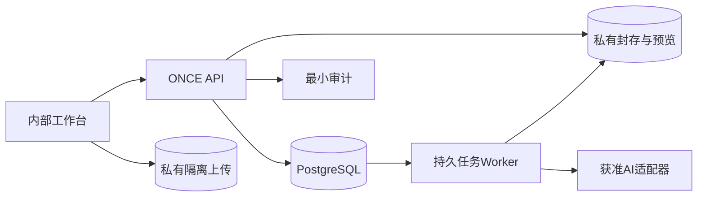

# ONCE Production OS｜开发实施文档｜先把内部 OS 做出来

版本：v0.5｜日期：2026-09-27｜当前范围：一期内部 OS + Talent Domain 2.0 R1 + AI｜状态：R1 SPEC_FROZEN，新增实现未执行

## 1. 实施目标

第一版让团队可以持续使用：Person 是统一自然人身份，TalentProfile 可选；人才下有 Role/Capability/Language/Location/Casting/Measurement/Representation/ExternalRef/Credential 等有来源事实；作品有真实署名，文件安全，Shortlist 保留 Role 上下文。AI/Agent 可辅助但不能静默覆盖事实。**Talent Domain 2.0 R1 必须先于正式人才 AI 契约完成。**

本文是开发入口；04定义业务行为；07/08/09定义实现契约；10定义工作包；12定义统一参数。以下结构和命令均是待创建的目标，不是现存源码或可直接运行的生产工具。

## 2. 技术默认与不做事项

| 项目 | 当前默认 | 边界 |
|---|---|---|
| 后端 | NestJS + TypeScript，模块化单体 | 选择性继承SRVF经验，不整仓改名 |
| 数据 | PostgreSQL + Prisma，必要约束补SQL迁移 | 一套业务库、稳定ID、组合FK、CAS；不需要图数据库 |
| 前端 | React + TypeScript + Vite；管理组件优先现成 | 一个内部Web应用；移动查看/轻录入；不建独立客户站 |
| 后台任务 | 同仓Worker独立进程，PG持久任务 | 无Redis/Kafka/BullMQ强依赖，不建事件总线平台 |
| 存储 | 私有COS候选；开发使用Local Provider | staging/final/rendition均私有，不需要public桶 |
| 认证 | 服务端不透明会话 + 安全Cookie | 无短信/微信/企微/SSO前置，不建服务账号控制台 |
| AI | 单个已批准供应商的适配器，四类文字任务 | SDK仅在适配层；不做任意工具执行和全库自由Agent |
| 检索 | 受限参数的SQL与关键词 | 有真实失败样本才再考虑向量能力 |

DEV-00根据当时支持周期和兼容测试锁定Node、数据库、依赖补丁、锁文件和镜像摘要。旧SRVF声明版本是历史兼容参考，不是新项目必须永久沿用的生产版本。[R01，见13] 本轮未查询最新包版本，不写无依据的“最新版”。

## 3. 一个内部应用，不是多个平台



没有连接官网的箭头；API不查CMS来决定ready；数据恢复不调用网站接口。

| 目录/责任域 | 独占写入 | 跨域开放 |
|---|---|---|
| identity / access | 账号、成员、会话、访问范围 | 当前身份、动作和字段权限 |
| talent / catalog | Person、optional TalentProfile、PersonRole、CapabilityDefinition/Capability、Language、Location、Casting/Measurement、Eligibility、ExternalRef、Representation、Credential、Translator关系、Schema Registry | 受限人物与主体引用；版本化 Talent Schema |
| sources / use-policy | 来源依据、核验、额外使用许可、限制 | 当前用途判定与来源证据 |
| media | 上传、对象、检查、资产及预览 | 当前可读的逻辑媒体；封存/检查命令 |
| portfolio | 作品、素材顺序、真实署名 | 作品事实与资产清单 |
| projects | 项目、参与、产出/参考、内部复盘 | 最小项目引用与实际合作 |
| shortlists | 内部需求清单、条目和备注 | 按当前权限过滤的清单 |
| ai-assist | AI任务、建议、Attempt、成本预留 | 有界建议；采纳通过目标域命令 |
| maintenance | 导入/导出/合并/删除的编排和清单 | 域授权后的维护动作，不自写人才事实 |
| platform | 审计、回执、持久任务运行机制 | 不含人才/作品/用途判断 |

这不是要求每行一个独立服务或npm包。共享数据库不等于任意跨域改表：由应用命令启动一次事务，各域入口接同一tx；只读聚合也经过统一权限过滤。平台不得反向依赖AI或ONCE业务细节。

### 3.1 Talent Domain 2.0 R1 的实现边界

Person 是现实自然人唯一主身份，**不等于 Talent**。TalentProfile 是 0..1 扩展；经纪人/客户联系人可只有 Person。PersonRole 是职业，PersonCapability 是能力；R1 不建立“大而全 ModelProfile”，Model UI 由 Role + CastingProfile + MeasurementSet + Capability + Collection + Work/Representation 组合。详细契约见 `15_TALENT_DOMAIN_2.md`。

当前 `Person.roles[] / skillCodes[] / languageCodes[] / cityCode / heightCm / sourceId` 视为过渡结构。TD2 只能追加前向 migration：新增结构 → 回填/双读 → 新写切换 → 兼容期 → 另一个 migration 删除旧列；`sourceId` 语义收窄为 originSource。稳定 Person/Work/Project/Asset ID 不变。

ExternalRef 提供精确身份映射但不允许模糊自动merge；ServicePrincipal 是独立 Machine Actor；FieldProposal 承接冲突或无直写权限的 Agent/Import/AI 建议。Shortlist 必须保存 personRoleId。MediaCollection type 与内容 tag 分离。

## 4. 目标仓库结构

```text
once-production-os/
  apps/api/src/{main.ts,worker-main.ts,modules/}
  apps/admin-web/src/
  packages/api-contract/       # 从OpenAPI生成，不向前端暴露Prisma类型
  prisma/{schema.prisma,migrations/,seed/}
  tests/{unit,integration,contract,journeys,faults/}
  scripts/                    # 本地bootstrap、preflight、隔离恢复验证
  ops/{compose,runbooks,config-examples/}
  docs/                       # 本版MD
  AGENTS.md
  pnpm-lock.yaml
```

只建立当前真正使用的目录。没有client-share、publishing、cms-adapter、公共站点模板和空未来业务模块。用于表达以后连接的类型可以等首次消费者出现再导出，不能先做大而空的shared-kernel。

## 5. 从空库开始的第一条旅程

1. `DEV-01`实现本地一次性bootstrap：仅空安装创建首个ADMIN；口令通过安全交互输入，无默认值，不提供匿名HTTP接口。
2. 管理员建立编辑账号并交付一次性激活凭证；编辑激活后得到内部会话。忘记密码走受控重置/重新激活，旧会话作废。
3. 编辑先建立 Person；只有作为制作人才时创建 TalentProfile + 至少一个 PersonRole。originSource 可内联创建；经纪人等普通联系人可只建 Person。同一人物增加第二职业只新增 Role，不复制 Person。后续 Language/Location/Capability/ExternalRef/Representation 等事实各自带来源。
4. 同页添加图片/PDF：创建UploadSession → 直传staging → complete返回任务ID → Worker封存并检查final → Asset绑定该source。一个source可含多文件，绑定由upload.sourceId推导，不由客户端任意改父对象。
5. 建Work，写真实作者/出镜/后期角色；外部作品保持EXTERNAL。关联某实际Project时区分REFERENCE和DELIVERABLE。
6. 按 Role、Capability、Language level、BASE/SERVICE Location、Work/Project/Collection 等事实检索；加入 Shortlist 时必须保存 personRoleId，再保存顺序/备注/选图。另一成员只看到自己有权的条目。
7. **先通过 Talent Domain 2.0 R1 Gate。** 外部 Agent 使用 ServicePrincipal + schemaVersion；无直写权/冲突时进入 FieldProposal。之后 AI 才按同一 Talent Schema 生成待确认字段。没有 AI 时人工路径完整可用。
8. 抽查来源、当前用途和审计；用内部JSON导出做隔离重建。恢复时不要求CMS存在。

这条旅程由前端和接口契约同时覆盖，不能只生成数据库表和Swagger就算交付。

## 6. 正式命令的固定顺序

先校验身份、当前空间/动作/输入Schema。按稳定actor + operation + idempotencyKey锁回执：已有相同摘要时返回最小安全回执（先复查当前读取资格），不要再次执行源revision检查；已有不同摘要则409。只有没有回执的新命令才锁业务根并检查expectedRevision、用途和状态，再同事务写事实、审计、回执和任务。

重放不是重新执行，不因上次成功令revision增加而报冲突；也不能绕过停用账号或收窄的数据范围。登录、激活、会话重置采用专门一次性语义；签名URL现签现验，绝不存回执重放。细则见09。

JSON摘要统一使用待验证的`once-jcs-v1`（RFC8785兼容）实现；不得在不同服务使用不同排序/trim规则。保留选定实现与测试向量，未验证不宣称兼容。[H-JCS，见13]

## 7. 使用规则要窄，不要做版权平台

用户保存内部草稿，只需填写真实接收依据、维护人、访问范围和临时期限；不用先完成全球展示权利方清点。事实核验、内部使用范围、原件读取、内部导出和第三方AI仍有各自必要边界。

UsePolicy是确定性函数，当前只处理有限用途：INTERNAL、INTERNAL_EXPORT、AI_PROCESS。内部依据在SourceRecord；后两者用窄的UsePermission与实际使用清单。复杂或不理解的条件人工确认，不能自动放行；不造通用规则DSL、任意审批工作流或合同引擎。

## 8. 文件链路

上传配额先预留；多次续签沿同一会话，不额外复制预算。staging和final不能同键。封存扫描针对实际final版本，检查通过之后才READY；后续对同文件的合法修改建立新Asset/版本，而非原地替换。

浏览器永远没有final写权限。图片/PDF在限制资源的隔离进程解析，视频只做首版支持的预览条件，不转发大型原片。派生预览不得扩大原件范围或绕过来源限制。无法提供图像预览时明确失败/占位，不伪报全部成功。

签名PUT的expectedSize不是云端已强制执行大小限制；真实存储启用时验证供应商实际控制。不能满足时采用有界流式入口或进一步限制，不通过把final桶公开修补问题。配额与供应商成本的剩余窗口见12。

## 9. AI链路与前端

首版四类任务以获准文字工作；PDF先本地提取文字。正式 `extract_profile / suggest_tags / parse_search` 必须在 TD2-06 Gate 后读取版本化 Talent Schema；旧 roles/skills/languageCodes/city/height 不能作为长期事实契约。图片视觉理解另增评审，且不得用于推断成年、国籍、健康、宗教等敏感事实。

输入白名单构造后保存sourceRevision、protectionEpoch、输入摘要、用途证据和providerConfigRevision。预算预留后排队；发送前原子写Attempt=MAY_HAVE_EXECUTED。请求未决时同job不能再发送另一Attempt。超时/进程崩溃先进入UNKNOWN并核对，不自动换模型再试。

提议面板显示原值、建议值、来源与未知项；多选字段一次确认是唯一P0采纳语义。确认前来源或权限变化则拒绝/标STALE。正式数据由人类动作进入原领域命令，AI不能把自述变核验、把许可变有效。

## 10. 内部页面的完成标准

人才：Person/Talent边界、Role、Capability、Language、Location、Casting/Measurement、Eligibility、ExternalRef、Representation、Credential、Collection、来源/证据/Proposal、作品/项目与联系信息。候选：按 Role Context 加入并筛选。AI/Agent：机器身份、Schema、Proposal、采纳。设置：人类账号、ServicePrincipal、字典/Schema、日志、作业和恢复状态。

所有表单对权限/状态失败给可执行下一步；冲突说明是谁/何时更新了可见部分，不泄露其他范围数据。不要出现“官网发布中”“客户反馈待处理”“正在锁档”等无一期对应功能的状态。

## 11. 后续扩展只冻结连接原则

| 未来模块 | 连接已有对象 | 未来自己维护 |
|---|---|---|
| CRM | Person/Organization/Brand/Project | 线索、商机、跟进，不改人才职业状态 |
| 报价 | Project/角色/服务类别 | 固定版本和金额币种，不覆盖历史 |
| 商业合同 | 当事方/Project/版本资料 | 合同和签署，不以资料许可替代 |
| 排期 | Person/Project/地点日期 | 可用时间、占位、预订，不把提名当锁档 |
| 财务 | 项目/主体及未来正式单据 | 账项/收付/更正，不在项目上加任意余额 |
| 对外协作/官网 | 经授权的领域Query DTO | 受众、公开快照、发布/撤回和渠道状态 |

以上不创建当前表、HTTP路由或任务。新增模块后仍通过有权限的应用接口、稳定ID和兼容迁移接入；不承诺未来永远零改造。

## 12. 开发顺序与完成定义

原 DEV-00～11 继续保留；v0.5 在 DEV-09 与 DEV-08 之间保留 TD2-01～06，但 R1 重定义其内容：Identity/Machine Actor → Common Facts → Casting/Representation → Media/Role Context → Search/Maintenance → Schema/Agent Gate。正式 M2 人才 AI 不得绕过 TD2-T01～18。

每个PR有范围、FR/T编号、迁移、权限/审计变更、真实执行证据与回滚/前滚方案。主代码测试、真实DB测试、供应商测试分别标识；NOT_RUN不能写成通过。不要一次把全套需求转成几十张CRUD表后再补安全和交互。
