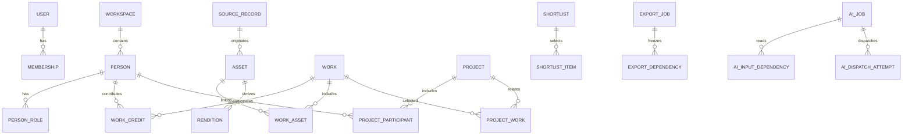

# ONCE Production OS｜数据模型与一致性契约｜仅当前实体

版本：v0.3｜日期：2026-09-22｜当前范围：一期内部 OS + AI｜状态：文档已修订，产品实现和运行测试未执行

## 1. 共同约定

这是一份待实现的逻辑/约束设计，不是已经生成或迁移成功的schema。表可在相同职责下合并，不能丢失必要不变量；也不要求每个概念一个独立服务。

主身份UUID，业务短号只是展示。业务表有workspaceId并建立`UNIQUE(workspaceId,id)`供组合FK使用；一期只运营一个空间，服务端从会话确定空间，不提供多租户开通。所有写入有revision及变更人/时间；部分安全对象另有protectionEpoch。

时刻用UTC+timestamptz；只有年月日的业务日期保持date+precision，不伪造00:00跨时区时刻。尺寸明确单位，未知null。秘密不放业务快照；金额仅在AI成本控制用定点十进制/最小单位，不创建商业账本。

## 2. 核心关系



人、文件、作品、项目是不同实体。内部候选只保存引用/备注，不复制一份对外人才表；内部语言文本可被删除，不是不可撤销的公开内容资产。

## 3. 身份、访问范围、目录

| 实体 | 最少字段 | 关键约束/归属 |
|---|---|---|
| workspace | id/name/status | 只运营ONCE；identity |
| user | loginName/passwordHash/status/sessionEpoch | 人类账号，不由Person自动生成 |
| membership | workspaceId/userId/roles/sensitivePermissions/status/revision | user+workspace唯一；角色有限 |
| session | hash/userId/membershipId/epoch/idleUntil/absoluteUntil/revokedAt | 存哈希；逐请求检查当前身份/epoch |
| activation_token | userId/hash/expiresAt/consumedAt | 一次性，CAS消费；不进通用回执 |
| access_scope / scope_member | mode=WORKSPACE或RESTRICTED，成员membershipId | 主对象scopeId；受限成员必须同空间；无任意策略DSL |
| dictionary_item | namespace/code/labelZh/labelEn/aliases/status/revision | workspace+namespace+code唯一；停用不删历史 |

主实体及敏感来源均有scopeId。依赖访问按相关父/来源的交集，不因把私有文件放进普通作品就扩大可见性。EDITOR不能用更新scope扩大可见范围；范围修改需指定管理权限并递增保护版本。

首次bootstrap是空安装维护操作，不是长期超管后门。内部Worker使用代码注册的任务能力和部署身份；不实现服务账号CRUD/OAuth/委托等额外平台。

## 4. 人物、职业、机构与事实

| 实体 | 最少字段 | 约束 |
|---|---|---|
| person | displayName/aliases/maintainerId/scopeId/sourceId/status/revision/protectionEpoch | 姓名/电话非唯一；DRAFT可不完整；ACTIVE只表示内部可用 |
| person_role | personId/roleCode/specialties/evidenceSourceId | 同人同角色唯一；多工种同ID |
| talent_profile | personId/cityCode/languages/skills/serviceAreas | 角色字段受Schema约束；不猜身份/国籍 |
| model_profile | personId/heightCm/clothingSize/shoeSize/measurements/measuredAt | 可选；只收必要自愿字段，明确单位 |
| contact_method | personId或organizationId/kind/encryptedValue/maskedValue/sourceId | exactly-one owner；单独权限；加密密钥版本可恢复 |
| organization | displayName/legalName可空/roles/sourceId/scopeId | 客户/经纪/供应商为角色，不是CRM流程 |
| brand | name/organizationId可空/sourceId/scopeId | 品牌不自动是法律主体 |
| person_organization | personId/organizationId/relation/sourceId/dateRange | 关系明确；不是自动“ONCE雇员”标记 |
| entity_alias | oldPersonId/canonicalPersonId/mergeDecisionId | 禁自指/环/跨空间；不合并登录账号 |

实体状态可用DRAFT/ACTIVE/ARCHIVED/ERASED；另以blockedAt/reason说明安全限制，不把每种用途失效都塞进人才生命周期。归档保留符合依据的历史查询；删除阻断后按保留决定处置。

## 5. 来源与窄用途记录

| 实体 | 必要字段 | 不变量 |
|---|---|---|
| source_record | type=MANUAL/TEXT/FILE_REFERENCE；providerClaim/receivedAt/textPayload可空/sourceUrl可空/scopeId/basisMode/basisDescription/validFrom/validUntil/status/maintainerId/revision/protectionEpoch | 创建时允许零文件；说明真实接收依据；外部URL只是引用，不自动抓取 |
| field_evidence | owner类型化FK/fieldPath/valueDigest/sourceId/sourceRevision/reviewType/reviewerId/reviewedAt | 仅注册字段；旧依据不自动证明新值 |
| use_permission | sourceId及精确主体/asset引用、purpose=INTERNAL_EXPORT或AI_PROCESS、fields、transformCodes、requiredCredit、providerIdentityHash可空、configRevision可空、dataCategories、validFrom/Until、status、evidenceNote、reviewerId、revision | 用途具体；AI绑定配置；限制不由AI改写；不能因为有此行就忽略实际条件 |
| use_restriction | subject类型化FK/purpose/reason/active/reviewerId/revision | 明确禁止优先；取消限制有依据与审计 |

内部用途INTERNAL由来源依据处理：`TEMP_ORGANIZE`允许限定人员在限定期限接收、查看、手工整理，不自动获得AI/导出许可；`INTERNAL_USE`须有明确有效依据。确认时更新来源版本，不能仅把临时期限反复延长充当长期依据。

source_record在初次接收时无需asset；媒体完成后Asset.sourceId绑定来源，一对多，无循环必填依赖。sourceUrl不允许被客户端指令转换成任意服务端下载地址。

多份来源支持同一事实时，所采用依据须显式记录。临时来源过期但确有独立有效替代依据，可重新核验绑定；不能机械删除所有合法事实，也不能不核实就自动选择一个“更宽松”的依据。

条件结构是有限枚举和人工说明，不是一般规则引擎。不能执行的条件（如禁止必要的解析/裁切）拒绝相关动作，用户可选择其他材料/手工录入。内部查看不需要建立全球公开权利方图。

## 6. 文件、封存、配额

| 实体 | 必要字段 | 约束 |
|---|---|---|
| upload_session | actorId/sourceId/scopeId/stagingLocator/expectedMime/expectedSize/state/expiresAt/renewCount/jobId/finalObjectId可空 | source和actor由会话/授权推导；重复完成同一job |
| upload_reservation | uploadId/workspaceId/actorId/reservedBytes/state | upload唯一；数量与暂存字节原子预留；释放一次 |
| storage_object | provider/region/bucket或root/key/versionId可空/sha256/sizeBytes/actualMime/sealedAt/state | locator固定；final不覆盖；ETag不是SHA256替代 |
| asset | sourceId/objectId/scopeId/originalName/state/revision/protectionEpoch | 逻辑用途与物理对象分开；同字节不同来源不自动合许可 |
| rendition | assetId/objectId/transformCode/transformVersion/width/height/duration/hash | 唯一asset+变换版本；与source同范围；无public标记 |
| media_inspection | objectId/checkVersion/result/reasonCode/metadata | 检查最终对象；有资源上限；不把扫描结果当著作权证明 |

封存过程：staging存在且实际大小合限 → 复制/有界流写入全新final位置 → 校验final → 安全预览 → READY。不得向浏览器发final写权限。失败final私有隔离，登记清理；不是直接按整个桶前缀删除。

数量/字节/解析并发四种配额分别约束。参数见12。续签沿原预留，取消/失败/到期幂等释放。云端不支持真正限制PUT大小时，expectedSize只约束应用准入而非费用硬上限；实际过大立即拒绝封存/解析并受限清理。

读取优先鉴权后有界流式转发（视频支持受限Range）；可选短签名时寿命不得超过相关用途剩余时间，日志不得记录完整URL。已经交付的字节和截图不能强制收回。

## 7. 作品、项目、语言与内部清单

| 实体 | 字段 | 约束 |
|---|---|---|
| work | title/summary/sourceId/productionOrigin/scopeId/industry/location/datePrecision/revision/protectionEpoch | EXTERNAL/ONCE/UNKNOWN；ONCE声明需要实际依据 |
| work_asset | workId/assetId/order/caption/credit | unique(workspace,work,asset)；不能跨作品错绑子项 |
| work_credit | workId/personId或organizationId/roleCode/sourceId | owner exactly-one；同一人多真实角色可分别记录 |
| project | title/clientOrganizationId可空/brandId可空/maintainerId/location/date/precision/state/sourceId/scopeId/revision | 不含价格、合同、收款、预订状态 |
| project_participant | projectId/personId/roleCode/status/sourceId | PROPOSED/CONFIRMED/ACTUAL；唯一项目+人+角色 |
| project_work | projectId/workId/relation/sourceId | DELIVERABLE/REFERENCE；参考不证明交付 |
| project_note | projectId/kind=RECAP或NOTE/body/sourceRefs/revision | 内部复盘；无独立CaseStudy/公开审批 |
| locale_text | personId/workId/projectId exactly-one、locale/text/sourceDigest/revision/reviewedBy可空/needsReview | 当前内部中英文本；依赖保存在locale_dependency，更新仅提示陈旧 |
| locale_dependency | localeTextId/注册主体FK/sourceRevision/protectionEpoch | 源受限时文本同样受限；需重核文本才能继续使用 |
| shortlist | title/brief/scopeId/maintainerId/revision | 内部编辑对象，不冻结客户发布版本 |
| shortlist_item | shortlistId/personId/workId可空/selectedAssetIds经关联表/order/note/addedSourceRevision | parent由路径推导；选图属该work（若指定）；人/作品关联需符合所选语义 |

`selectedAssetIds`在持久层是有外键的shortlist_item_asset关系，不用无约束JSON数组。内部清单读取按当前范围/来源过滤，不能证明某项有效则整项隐藏；只返回“条目不可用”给有清单权限者，不泄露无权名字或原备注。

locale_text不会按语言创建第二个Person；事实变化导致needsReview，安全状态变化导致禁止继续处理其依赖内容。是否重新核验由明确人类动作决定。

## 8. AI与导出的使用清单

AIJob和ExportJob各维护自己的窄Dependency表；不是提前建设通用内容图谱。每行使用类型化外键到Person/Source/Asset/Work/Project/LocaleText/UsePermission等已登记对象，exactly-one；所有关联必须同空间。

清单保存实际输入/输出涉及的对象、字段、sourceRevision、protectionEpoch、选用许可id/revision、实际媒体版本、截止时间及schemaVersion。只保存查询条件或“有export权限”不能证明生成文件包含哪些字节。

| 实体 | 字段/规则 |
|---|---|
| ai_job | actor/taskType/inputManifest/inputDigest/providerIdentityHash/configRevision/promptVersion/outputSchemaVersion/status/cancelRequested/costReservation/sourceDependencies |
| ai_dispatch_attempt | jobId/attemptNo/requestDigest/providerConfigRevision/providerIdempotencyKey可空/state/providerRequestId可空/settlementRef可空；同job最多一条未决Attempt |
| ai_proposal | jobId/targetRef/baseRevision/state/payload/appliedFields/discardedFields/appliedBy/At；一次采纳后APPLIED |
| ai_cost_reservation | jobId唯一/budgetPeriod/reservedAmount/settledAmount/usageStatus；未知结果继续占预留 |
| export_job | actor/format=JSON/schemaVersion/fields/recordManifest/objectId/hash/state/expiresAt/approvedUseManifest |
| export_dependency | exportId/具体记录FK/fields/sourceRevision/protectionEpoch/usePermissionId/revision；用于执行和下载复查 |
| deletion_request/item | 目标、清理计划、保留决定、依赖种类、当前处置状态和安全证据 |

额外许可与执行使用清单分开：许可说明可以做什么；manifest说明这一回真正做什么。AI不得发送未在清单中的联系人或整份原件；内部导出不带密钥/会话/机器凭证。没有公开发布owner或CMS远端字段。

## 9. 平台持久机制

command_receipt：workspaceId+稳定actorId+operation+key唯一；requestDigest、最小安全result、createdAt/retentionUntil。摘要方案统一，成功回执不可通过一般PATCH改写。秘密不入回执；已删除实体可只返回获准的最小处置编号。

durable_job：type/schemaVersion/aggregateId/revision/requestActorId/attempts/leaseToken/leaseUntil/state/nextAttemptAt。类型有限；新版本不识别payload时隔离而非默默忽略。Domain写入与enqueue同事务，网络/解析在事务外。

audit_event：固定事件Schema、操作者、人类申请者（如有）、资源ID、动作、时间、requestId、少量允许差异。安全失败日志不当作成功事件。

恢复安全变化记录可用只追加的最小journal投影到独立备份位置，不要求消息总线；其不完整性必须被恢复流程承认。无可信完整日志时隔离旧数据并人工核实，不能发明“已自动重放到最新”。

## 10. 必须实现的组合与父子约束

所有子表通过workspace组合FK指向所属对象；同时限制真实父子关系。例如：

```sql
-- 设计示例；待DEV-05在选定PG版本以真实迁移测试，不是已执行SQL。
ALTER TABLE work_asset ADD CONSTRAINT work_asset_parent_uq
  UNIQUE (workspace_id, work_id, id, asset_id);
ALTER TABLE shortlist_item_asset ADD CONSTRAINT shortlist_exact_work_asset_fk
  FOREIGN KEY (workspace_id, work_id, work_asset_id, asset_id)
  REFERENCES work_asset (workspace_id, work_id, id, asset_id);
```

shortlist_item_asset是当前清单选图关系。assetId始终具有有效FK；声明所选作品时workId/workAssetId须同时存在，并由该组合FK绑定真实父对象；未声明作品时这两字段同时为空。不能只验证work和asset分别存在于当前workspace。请求中的父ID能从已认证路径推导时不再接受重复body字段。

数据库约束保护结构，领域函数校验当前权限和用途。跨表资格不用单表CHECK伪装完成；需要真数据库测试。

## 11. 并发、锁与清理

命令先锁回执域，再按确定顺序锁业务根与使用依据（类型顺序在实现注册表固定，再按UUID排序），最后更新依赖/审计/任务。不在锁内调模型或复制大文件。执行时所有write门重新判定，避免预览后来源已变还提交。

protectionEpoch变化包括范围收窄、用途暂停、资产隔离、源依据不再有效和删除；正文普通修改只升revision。到期即时由时钟判断，不能等待epoch任务更新才能拒绝。

删除允许销毁过去冻结payload/文件，留下必要的ERASED最小头。依赖索引要覆盖语言文本、AI缓存、导出、预览和工作备注；暂不能证明局部合法性，先整件不可用。已独立核验且存在其他依据的事实通过另一个审核决定保留，不自动抹除全部关联历史。

## 12. 以后再增加的表

本期不创建客户访问/反馈、公开内容审批/发布、站点映射、公开媒体或商业模块表。业务扩展以稳定主体ID、scope、revision和有权限的Query/Command契约接入。新表和权限随新需求兼容迁移，避免现在把假空表误当成熟底座。
