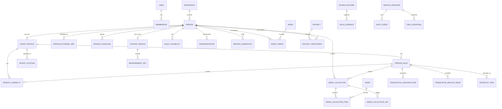

# ONCE Production OS｜数据模型与一致性契约｜仅当前实体

版本：v0.5｜日期：2026-09-27｜当前范围：一期内部 OS + Talent Domain 2.0 R1 + AI｜状态：R1 SPEC_FROZEN，尚未迁移

## 1. 共同约定

这是一份待实现的逻辑/约束设计，不是已经生成或迁移成功的schema。表可在相同职责下合并，不能丢失必要不变量；也不要求每个概念一个独立服务。

主身份UUID，业务短号只是展示。业务表有workspaceId并建立`UNIQUE(workspaceId,id)`供组合FK使用；一期只运营一个空间，服务端从会话确定空间，不提供多租户开通。所有写入有revision及变更人/时间；部分安全对象另有protectionEpoch。

时刻用UTC+timestamptz；只有年月日的业务日期保持date+precision，不伪造00:00跨时区时刻。尺寸明确单位，未知null。秘密不放业务快照；金额仅在AI成本控制用定点十进制/最小单位，不创建商业账本。

## 2. 核心关系



人、文件、作品、项目是不同实体。内部候选只保存引用/备注，不复制一份对外人才表；内部语言文本可被删除，不是不可撤销的公开内容资产。

## 3. 身份、访问范围、目录

| 实体 | 最少字段 | 关键约束/归属 |
|---|---|---|
| workspace | id/name/status | 只运营ONCE；identity |
| user | loginName/passwordHash/status/sessionEpoch | 人类账号，不由Person自动生成 |
| membership | workspaceId/userId/roles/sensitivePermissions/status/revision | user+workspace唯一；角色有限 |
| session | hash/userId/membershipId/epoch/idleUntil/absoluteUntil/revokedAt | 存哈希；逐请求检查当前身份/epoch |
| activation_token | userId/hash/expiresAt/consumedAt | 一次性，CAS消费；不进通用回执 |
| access_scope / scope_member | mode=WORKSPACE或RESTRICTED，成员membershipId | 主对象scopeId；受限成员必须同空间；无任意策略DSL |
| dictionary_item | namespace/code/labelZh/labelEn/aliases/status/revision | workspace+namespace+code唯一；停用不删历史 |

主实体及敏感来源均有scopeId。依赖访问按相关父/来源的交集，不因把私有文件放进普通作品就扩大可见性。EDITOR不能用更新scope扩大可见范围；范围修改需指定管理权限并递增保护版本。

首次bootstrap是空安装维护操作，不是长期超管后门。内部Worker使用代码注册的任务能力和部署身份；不实现服务账号CRUD/OAuth/委托等额外平台。

## 4. 人物、人才、职业与机器身份

Talent Domain 2.0 R1 的完整冻结规则见 [15_TALENT_DOMAIN_2.md](15_TALENT_DOMAIN_2.md)。核心修订是：**Person 不等于 Talent；来源不再只有一个“主来源”；Agent 不是人类账号。**

| 实体 | 最少字段 | 约束 |
|---|---|---|
| person | displayName/aliases/maintainerId/scopeId/originSourceId/status/revision/protectionEpoch | 自然人主身份；可只是经纪人/客户联系人；不要求TalentProfile |
| talent_profile | personId/status/internalSummary可空/revision | Person 0..1；存在它才允许人才Role/Capability等 |
| person_role | id/personId/roleCode/status/sourceId/validFrom/validUntil/revision | Person必须已有TalentProfile；同一Role有效期不可重叠重复 |
| capability_definition | code/labels/aliases/applicableRoles/levelScheme/status/schemaVersion | code语义稳定；Agent不能自由创建 |
| person_capability | personId/personRoleId可空/capabilityCode/levelCode/sourceId/validFrom/validUntil/revision | Role非空必须属于同一Person；GENERAL能力不猜Role |
| person_language | personId/languageCode/speaking/listening/reading/writing/sourceId/verifiedAt/validity/revision | 旧languageCodes只回填“会”，熟练度未知 |
| talent_location | personId/locationCode/relation=BASE或SERVICE/sourceId/validity/verifiedAt/revision | 当前与历史地点可区分；服务地区不再无来源数组 |
| person_external_ref | personId/providerCode/namespace或issuer/externalKey/sourceId/state/verifiedAt/revision | 精确Ref唯一解析；姓名/头像不自动merge |
| casting_profile | personId/currentMeasurementSetId可空/hairColor/eyeColor/observedOn/sourceId/revision | 跨MODEL/ACTOR/KOL复用，不是Model专属 |
| measurement_set | personId/measuredOn/precision/height/bust/waist/hips/shoeValue+system/clothingValue+system/sourceId/status/revision | 时间快照；CONFIRMED历史不静默覆盖 |
| adult_eligibility | personId/state/sourceId/verifiedBy/At/validUntil/evidenceAssetId可空/revision | UNKNOWN不等于成年；不要求保存身份证/完整生日 |
| representation | representedPersonId/personRoleId可空/agencyId可空/agentPersonId可空/relation/territory/sourceId/validity/status/revision | Agency/Agent至少一个；可按Role/地区表达；无佣金合同 |
| person_credential | personId/personRoleId可空/type/issuer/encrypted或masked identifier/issuedOn/expiresOn/status/sourceId/evidenceAssetId可空/revision | Credential≠Capability；敏感编号默认不出普通DTO |
| translator_language_pair | personRoleId/sourceLanguage/targetLanguage/sourceId/status/revision | Role必须TRANSLATOR；不从PersonLanguage猜方向 |
| translator_service_mode | personRoleId/modeCode/sourceId/status/revision | 如ON_SET/CONSECUTIVE/SIMULTANEOUS |
| service_principal | displayName/status/scopeId/permissionCodes/defaultMaintainerMembershipId/credentialHash/keyVersion/expiresAt/revision | 最小机器身份；不冒充User；默认无admin/merge/delete/批准权限 |
| field_proposal | typed target/fieldPath/proposedValue/valueDigest/sourceId/sourceRevision/originType/actor/baseRevision/schemaVersion/state | 字段必须Schema注册；冲突/无直写权时走proposal |

### 4.1 Person ≠ Talent

Person 是自然人容器；TalentProfile 才表示“作为 ONCE 制作人才管理”。经纪人、品牌联系人、客户联系人可以仅有 Person。PersonRole、Capability、TalentLocation 等人才事实必须以 TalentProfile 存在为前提。

当前 `Person.sourceId` 在R1语义上收窄为 `originSourceId`：只表示身份最初进入系统的来源，不再作为整个人才资料的“主来源”。

### 4.2 Role 与 Capability

Role回答“以什么职业参与制作”；Capability回答“会什么”。例如 INDUSTRIAL_PHOTOGRAPHER 必须拆为 PHOTOGRAPHER + INDUSTRIAL capability。摄影、剪辑、导演、化妆等不为每个职业建专属表。

### 4.3 Model UI 是组合视图

R1 取消数据库层“大而全 ModelProfile”。UI 的 Model Profile 由 MODEL Role + CastingProfile + current MeasurementSet + Capability + MediaCollection + Work + Representation 组合。Actor/KOL 可共享 Casting/Measurement，不复制身高/外观事实。

### 4.4 Agent 身份

ServicePrincipal 与 Membership 分开。CommandReceipt/Audit/Job requester 需要支持 humanMembershipId 或 servicePrincipalId exactly-one；业务 maintainer 仍是明确人类责任人，Machine Actor 的审计不能伪装成 maintainer。

## 5. 来源与窄用途记录

| 实体 | 必要字段 | 不变量 |
|---|---|---|
| source_record | type=MANUAL/TEXT/FILE_REFERENCE；providerClaim/receivedAt/textPayload可空/sourceUrl可空/scopeId/basisMode/basisDescription/validFrom/validUntil/status/maintainerId/revision/protectionEpoch | 创建时允许零文件；说明真实接收依据；外部URL只是引用，不自动抓取 |
| field_evidence | owner类型化FK/fieldPath/valueDigest/sourceId/sourceRevision/reviewType/reviewerId/reviewedAt | 仅注册字段；旧依据不自动证明新值 |
| use_permission | sourceId及精确主体/asset引用、purpose=INTERNAL_EXPORT或AI_PROCESS、fields、transformCodes、requiredCredit、providerIdentityHash可空、configRevision可空、dataCategories、validFrom/Until、status、evidenceNote、reviewerId、revision | 用途具体；AI绑定配置；限制不由AI改写；不能因为有此行就忽略实际条件 |
| use_restriction | subject类型化FK/purpose/reason/active/reviewerId/revision | 明确禁止优先；取消限制有依据与审计 |

内部用途INTERNAL由来源依据处理：`TEMP_ORGANIZE`允许限定人员在限定期限接收、查看、手工整理，不自动获得AI/导出许可；`INTERNAL_USE`须有明确有效依据。确认时更新来源版本，不能仅把临时期限反复延长充当长期依据。

source_record在初次接收时无需asset；媒体完成后Asset.sourceId绑定来源，一对多，无循环必填依赖。sourceUrl不允许被客户端指令转换成任意服务端下载地址。

多份来源支持同一事实时，所采用依据须显式记录。临时来源过期但确有独立有效替代依据，可重新核验绑定；不能机械删除所有合法事实，也不能不核实就自动选择一个“更宽松”的依据。

条件结构是有限枚举和人工说明，不是一般规则引擎。不能执行的条件（如禁止必要的解析/裁切）拒绝相关动作，用户可选择其他材料/手工录入。内部查看不需要建立全球公开权利方图。

## 6. 文件、封存、配额

| 实体 | 必要字段 | 约束 |
|---|---|---|
| upload_session | actorId/sourceId/scopeId/stagingLocator/expectedMime/expectedSize/state/expiresAt/renewCount/jobId/finalObjectId可空 | source和actor由会话/授权推导；重复完成同一job |
| upload_reservation | uploadId/workspaceId/actorId/reservedBytes/state | upload唯一；数量与暂存字节原子预留；释放一次 |
| storage_object | provider/region/bucket或root/key/versionId可空/sha256/sizeBytes/actualMime/sealedAt/state | locator固定；final不覆盖；ETag不是SHA256替代 |
| asset | sourceId/objectId/scopeId/originalName/state/revision/protectionEpoch | 逻辑用途与物理对象分开；同字节不同来源不自动合许可 |
| rendition | assetId/objectId/transformCode/transformVersion/width/height/duration/hash | 唯一asset+变换版本；与source同范围；无public标记 |
| media_inspection | objectId/checkVersion/result/reasonCode/metadata | 检查最终对象；有资源上限；不把扫描结果当著作权证明 |
| media_collection | personId/personRoleId可空/collectionTypeCode/title/sourceId/status/revision | 只表达资料形式；可Person级或Role级；不替代Work |
| media_collection_tag | collectionId/tagCode/sourceId/revision | 表达FASHION/BEAUTY/LINGERIE等内容标签，与collection type分离 |
| media_collection_item | collectionId/assetId/orderIndex/caption可空/featured/revision | 同一Asset可复用；unique(collection,asset)；不复制StorageObject |

封存过程：staging存在且实际大小合限 → 复制/有界流写入全新final位置 → 校验final → 安全预览 → READY。不得向浏览器发final写权限。失败final私有隔离，登记清理；不是直接按整个桶前缀删除。

数量/字节/解析并发四种配额分别约束。参数见12。续签沿原预留，取消/失败/到期幂等释放。云端不支持真正限制PUT大小时，expectedSize只约束应用准入而非费用硬上限；实际过大立即拒绝封存/解析并受限清理。

读取优先鉴权后有界流式转发（视频支持受限Range）；可选短签名时寿命不得超过相关用途剩余时间，日志不得记录完整URL。已经交付的字节和截图不能强制收回。

MediaCollection只引用READY且当前可读的Asset。一个Asset可以同时进入Portfolio、Work和Shortlist；集合删除只删除组织关系，不删除Asset。CollectionType只表达资料形式：MODEL_CARD、POLAROIDS、PORTFOLIO、SHOWREEL、INTRO_VIDEO、OTHER；FASHION、BEAUTY、COMMERCIAL、LINGERIE、RUNWAY、LIFESTYLE等进入MediaCollectionTag。

## 7. 作品、项目、语言与内部清单

| 实体 | 字段 | 约束 |
|---|---|---|
| work | title/summary/sourceId/productionOrigin/scopeId/industry/location/datePrecision/revision/protectionEpoch | EXTERNAL/ONCE/UNKNOWN；ONCE声明需要实际依据 |
| work_asset | workId/assetId/order/caption/credit | unique(workspace,work,asset)；不能跨作品错绑子项 |
| work_credit | workId/personId或organizationId/roleCode/sourceId | owner exactly-one；同一人多真实角色可分别记录 |
| project | title/clientOrganizationId可空/brandId可空/maintainerId/location/date/precision/state/sourceId/scopeId/revision | 不含价格、合同、收款、预订状态 |
| project_participant | projectId/personId/roleCode/status/sourceId | PROPOSED/CONFIRMED/ACTUAL；唯一项目+人+角色 |
| project_work | projectId/workId/relation/sourceId | DELIVERABLE/REFERENCE；参考不证明交付 |
| project_note | projectId/kind=RECAP或NOTE/body/sourceRefs/revision | 内部复盘；无独立CaseStudy/公开审批 |
| locale_text | personId/workId/projectId exactly-one、locale/text/sourceDigest/revision/reviewedBy可空/needsReview | 当前内部中英文本；依赖保存在locale_dependency，更新仅提示陈旧 |
| locale_dependency | localeTextId/注册主体FK/sourceRevision/protectionEpoch | 源受限时文本同样受限；需重核文本才能继续使用 |
| shortlist | title/brief/scopeId/maintainerId/revision | 内部编辑对象，不冻结客户发布版本 |
| shortlist_item | shortlistId/personId/**personRoleId**/workId可空/selectedAssetIds经关联表/order/note/addedPersonRevision/addedRoleRevision/addedSourceRevision | Role上下文必存；多Role不猜；选图/Collection/Capability按该Role解释 |

`selectedAssetIds`在持久层是有外键的shortlist_item_asset关系，不用无约束JSON数组。ShortlistItem 必须持久化 personRoleId 且确认属于 personId；若人才只有一个 active Role，UI 可自动选择，但数据库不省略上下文。Role 失效后条目不可静默切到另一个Role。内部清单读取按当前范围/来源过滤，不能证明某项有效则整项隐藏；只返回“条目不可用”给有清单权限者，不泄露无权名字或原备注。

locale_text不会按语言创建第二个Person；事实变化导致needsReview，安全状态变化导致禁止继续处理其依赖内容。是否重新核验由明确人类动作决定。

## 8. AI、Agent、Proposal 与导出的使用清单

AIJob 和 ExportJob 继续维护自己的窄 Dependency 表。Talent 2.0 R1 另增加版本化 Talent Schema 与 FieldProposal，解决外部 Agent/Import/AI 的结构化建议与冲突写入。

### 8.1 FieldProposal

Proposal 只允许指向 Schema Registry 中注册的 typed target/fieldPath。保存 proposedValue、valueDigest、sourceRevision、baseRevision、schemaVersion、originType=IMPORT/AGENT/AI 与真实 actor。source/target/schema变化后为 STALE。

ServicePrincipal 无 `talent.fact.write` 时只能创建 Proposal；即使有直写权限，和当前受保护事实冲突时也不得静默覆盖。APPLIED 必须调用目标域命令，不直接UPDATE表。

### 8.2 Machine Actor

CommandReceipt、AuditEvent、DurableJob/Requester 等 actor 改为 human Membership / ServicePrincipal exactly-one。ServicePrincipal 有 scope/permission/defaultMaintainer/credential rotation；机器身份不得拥有默认高危管理权。

### 8.3 AI / Export 依赖

AIJob 与 ExportDependency 在 TD2 后可引用 Role、Capability、Language、Location、Casting/Measurement、Eligibility、Credential、Collection 等登记对象/字段；敏感Credential标识、AdultEligibility原证据、Machine credential 默认不进入导出/AI。

额外许可与执行 manifest 分开：许可说明可以做什么；manifest说明这一回真正做什么。没有公开发布owner或CMS远端字段。

## 9. 平台持久机制

command_receipt：workspaceId+稳定actorId+operation+key唯一；requestDigest、最小安全result、createdAt/retentionUntil。摘要方案统一，成功回执不可通过一般PATCH改写。秘密不入回执；已删除实体可只返回获准的最小处置编号。

durable_job：type/schemaVersion/aggregateId/revision/requestActorId/attempts/leaseToken/leaseUntil/state/nextAttemptAt。类型有限；新版本不识别payload时隔离而非默默忽略。Domain写入与enqueue同事务，网络/解析在事务外。

audit_event：固定事件Schema、操作者、人类申请者（如有）、资源ID、动作、时间、requestId、少量允许差异。安全失败日志不当作成功事件。

恢复安全变化记录可用只追加的最小journal投影到独立备份位置，不要求消息总线；其不完整性必须被恢复流程承认。无可信完整日志时隔离旧数据并人工核实，不能发明“已自动重放到最新”。

## 10. 必须实现的组合与父子约束

所有子表通过workspace组合FK指向所属对象；同时限制真实父子关系。例如：

```sql
-- 设计示例；待DEV-05在选定PG版本以真实迁移测试，不是已执行SQL。
ALTER TABLE work_asset ADD CONSTRAINT work_asset_parent_uq
  UNIQUE (workspace_id, work_id, id, asset_id);
ALTER TABLE shortlist_item_asset ADD CONSTRAINT shortlist_exact_work_asset_fk
  FOREIGN KEY (workspace_id, work_id, work_asset_id, asset_id)
  REFERENCES work_asset (workspace_id, work_id, id, asset_id);
```

shortlist_item_asset是当前清单选图关系。assetId始终具有有效FK；声明所选作品时workId/workAssetId须同时存在，并由该组合FK绑定真实父对象；未声明作品时这两字段同时为空。不能只验证work和asset分别存在于当前workspace。请求中的父ID能从已认证路径推导时不再接受重复body字段。

数据库约束保护结构，领域函数校验当前权限和用途。跨表资格不用单表CHECK伪装完成；需要真数据库测试。

## 11. 并发、锁与清理

命令先锁回执域，再按确定顺序锁业务根与使用依据（类型顺序在实现注册表固定，再按UUID排序），最后更新依赖/审计/任务。不在锁内调模型或复制大文件。执行时所有write门重新判定，避免预览后来源已变还提交。

protectionEpoch变化包括范围收窄、用途暂停、资产隔离、源依据不再有效和删除；正文普通修改只升revision。到期即时由时钟判断，不能等待epoch任务更新才能拒绝。

删除允许销毁过去冻结payload/文件，留下必要的ERASED最小头。依赖索引要覆盖语言文本、AI缓存、导出、预览和工作备注；暂不能证明局部合法性，先整件不可用。已独立核验且存在其他依据的事实通过另一个审核决定保留，不自动抹除全部关联历史。

## 12. 以后再增加的表

本期仍不创建客户访问/反馈、公开内容审批/发布、站点映射、商业模块表。报价、档期、Booking、合同、佣金、工资、CRM、KOL分析、设备库存不进入Talent。

Talent 2.0 R1 同样禁止“一职业一张表”。新增职业扩展必须满足：真实高频结构化筛选需求、稳定校验规则、无法由 Role + Capability + Work + Credential + Collection 表达。

### 12.1 R1 迁移边界

当前实现中的 Person.roles[] / skillCodes[] / languageCodes[] / cityCode / heightCm 是迁移输入，不是目标模型。迁移顺序：

1. 增加 optional TalentProfile、Role/Capability、Language/Location、Casting/Measurement、Eligibility、Representation、ExternalRef、Credential、MediaCollection、ServicePrincipal/Actor、Proposal；
2. 回填 roles → PersonRole；skills → GENERAL Capability；languageCodes → PersonLanguage(level=null)；cityCode → BASE TalentLocation；
3. Person.sourceId 收窄为 originSourceId 语义；
4. heightCm 只有在明确相关语义时进入 MeasurementSet，否则进入迁移审查，禁止从height反推MODEL；
5. Shortlist 对单Role可回填personRoleId，多Role进入人工迁移队列；
6. 双读验证、新写切换、Merge/Delete/Export/Rebuild/Recovery全部接线；
7. 最后另一个前向migration删除旧列。

稳定 Person/Work/Project/Asset UUID 全程不变。
