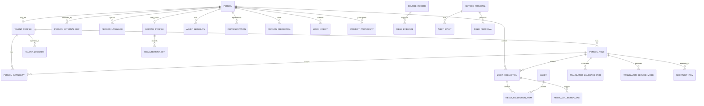

# ONCE Production OS｜Talent Domain 2.0 R1 Freeze

版本：v0.5｜日期：2026-09-27｜状态：R1 重新冻结候选，尚未实现

## 1. 目的与第一性原理

Talent Domain 管理的不是“模特表、摄影师表、翻译表、剪辑师表”，而是：

1. **Identity**：现实中的这个人是谁；
2. **Talent membership**：这个人是否作为 ONCE 的制作人才被管理；
3. **Role**：这个人以什么职业参与制作；
4. **Capability**：这个人会什么、擅长什么；
5. **State / temporal facts**：地点、语言能力、外观/尺寸、代表关系等当前或历史状态；
6. **Evidence**：为什么相信这些事实、来自哪个来源、何时核验；
7. **Context**：在某个 Work、Project、Shortlist 中，这个人以什么角色出现；
8. **Machine access**：外部 Agent 如何识别人、以什么机器身份、按什么 Schema 写入。

本升级不重写 Asset、Work、Project、Source、Shortlist、UsePermission、Merge/Delete/Export/Rebuild/Recovery 等既有领域；它要求这些领域能够正确引用 Talent 2.0 新关系。

本升级不建立人才市场、CRM、报价、合同、财务、排期、Booking 或公开人才门户。

## 2. R1 冻结原则

1. **Person 是自然人，不等于 Talent。** 客户联系人、经纪人、品牌联系人也可以是 Person；TalentProfile 是可选的 0..1 扩展。
2. **一个现实人物只有一个 Person。** 多职业通过 PersonRole 表达，不复制人物。
3. **Role 表达“是什么”，Capability 表达“会什么”。** 不创建“工业摄影师/产品摄影师/汽车摄影师”等爆炸式 Role。
4. **事实允许多来源。** Person 的来源只表示“身份最初如何进入系统”；具体字段、关系、能力由各自 Evidence 支撑。
5. **新来源冲突不自动覆盖当前事实。** 冲突进入受 Schema 约束的 proposal/review 路径。
6. **时间会改变的事实必须能表达时间。** 地点、语言水平、尺寸、外观、代表关系、资格证等不假装永恒不变。
7. **UI 的“Model Profile / Translator Profile”可以是组合视图，不要求数据库一职业一表。**
8. **Asset、MediaCollection、Work 三层分离。** Asset 是文件，Collection 是组织方式，Work 是真实作品。
9. **Shortlist 选择的是“Person 以某个 Role 进入候选”，不是只选 Person。**
10. **ExternalRef 只做精确身份映射，不做模糊自动合并。**
11. **Agent 是独立 Machine Actor，不冒充内部员工。** 机器权限、scope、credential、审计独立。
12. **Capability / Role / Field 都由版本化 Schema Registry 定义。** Agent 不得自造 code 或字段。
13. **AI/Agent 的建议不是业务事实。** 无权写事实或发生冲突时进入 proposal；正式采纳仍走领域命令。
14. **敏感/资格事实 fail closed。** 不根据照片推断年龄、国籍、健康、宗教等；成人资格使用明确声明/核验记录。
15. **旧稳定 ID 不变。** Person/Work/Project/Asset 等既有 UUID 不因升级重建。
16. **只追加前向 migration。** 不改写已应用历史 migration。

## 3. 目标关系



图只表示领域关系，不要求每个名词独立服务。

## 4. Person 与 TalentProfile

### 4.1 Person

Person 表示现实中的自然人。

保留/目标字段：

- id；
- displayName；
- aliases；
- scopeId；
- **originSourceId**：只表示“这个身份最初从哪里进入系统”；
- maintainerMembershipId；
- status；
- revision / protectionEpoch；
- createdAt / updatedAt。

R1 后禁止继续把 Person.originSourceId 解释为“这个人所有资料的主来源”。

客户联系人、经纪人、品牌联系人可以只有 Person，不必有 TalentProfile。

### 4.2 TalentProfile

TalentProfile 是 Person 的可选 0..1 扩展，表示“该 Person 被 ONCE 作为制作人才管理”。

字段保持克制：

- personId；
- status；
- internalSummary 可空；
- profileRevision；
- createdAt / updatedAt。

城市、服务地区、语言、身高等不再塞回 TalentProfile 数组/标量；这些是独立、可带来源与时间的事实。

### 4.3 Talent 边界

只有存在 TalentProfile 才允许创建 PersonRole、TalentLocation、PersonCapability 等人才事实。

Representation 的 agentPersonId、Organization 联系人等可以指向没有 TalentProfile 的 Person。

## 5. PersonRole

PersonRole 表示“这个 Talent 以什么职业参与制作”。

字段：

- id；
- personId；
- roleCode；
- status；
- sourceId；
- validFrom / validUntil 可空；
- revision。

约束：

- workspace + personId + roleCode + active period 不允许重叠重复；
- Person 必须已有 TalentProfile；
- Role 停用不删除旧 Work/Project 历史；
- Role 不承载报价、档期、预订。

首批 RoleDefinition 可包含：

MODEL、ACTOR、KOL、PHOTOGRAPHER、VIDEOGRAPHER、DIRECTOR、EDITOR、COLORIST、MAKEUP_ARTIST、STYLIST、TRANSLATOR、PRODUCER、LIGHTING、DRONE_OPERATOR 等。

新增 Role code 不等于新增数据库表。

## 6. Capability 与 Schema Registry

### 6.1 CapabilityDefinition

Capability 必须先注册定义，不能让 Agent/用户无限自由造标签。

至少定义：

- code；
- labelZh / labelEn；
- aliases；
- applicableRoleCodes；
- levelSchemeCode 可空；
- status；
- semanticVersion / schemaVersion。

语义发生变化时新建 code；不要把原 code 的含义静默改掉。标签/别名可以修订。

例：

- INDUSTRIAL
- PRODUCT
- FASHION
- LIGHTING
- COLOR_GRADING
- MOTION_GRAPHICS
- RUNWAY
- LINGERIE
- CONSECUTIVE_INTERPRETATION

### 6.2 PersonCapability

字段：

- personId；
- personRoleId 可空；
- capabilityCode；
- levelCode 可空；
- sourceId；
- validFrom / validUntil 可空；
- revision。

personRoleId 为空表示通用能力；非空时必须属于同一 Person。

现有 `skillCodes[]` 迁移为 GENERAL capability，不猜测属于哪个 Role。

## 7. Language：从 languageCodes[] 升级为 PersonLanguage

“会英语”不能只用一个 code 表示。

PersonLanguage：

- personId；
- languageCode；
- speakingLevelCode 可空；
- listeningLevelCode 可空；
- readingLevelCode 可空；
- writingLevelCode 可空；
- sourceId；
- verifiedAt 可空；
- validFrom / validUntil 可空；
- revision。

Level 使用稳定字典，例如 BASIC / WORKING / PROFESSIONAL / FLUENT / NATIVE；未知为 null，不自动抬高。

旧 `languageCodes[]` 回填为 PersonLanguage，仅表示“已知会该语言”，熟练度全部 null，禁止迁移时猜级别。

Translator 的语言对是另外的职业事实，不能仅根据 PersonLanguage 自动推断翻译方向。

## 8. Location：当前城市与服务地区必须可变化

TalentLocation：

- personId；
- locationCode；
- relationCode = BASE / SERVICE；
- sourceId；
- validFrom / validUntil 可空；
- verifiedAt 可空；
- revision。

同一 Person 可有一个当前 BASE、多条 SERVICE；历史位置不覆盖删除。

旧 `cityCode` 可回填为当前 BASE；未来服务地区不再使用无来源数组。

## 9. CastingProfile 与 MeasurementSet

R1 不再创建一个“大而全的 ModelProfile 表”。

UI 可以继续叫“Model Profile”，但它是以下事实的组合视图：

```text
Person
+ MODEL PersonRole
+ CastingProfile
+ current MeasurementSet
+ Model capabilities
+ MediaCollections
+ Work / WorkCredit
+ Representation
```

这样 Actor / KOL 等镜头人才也能复用相同身体/外观事实，不复制 height/hair/eyes。

### 9.1 CastingProfile

Person 0..1，可用于确有选角需要的人才：

- personId；
- currentMeasurementSetId 可空；
- hairColorCode 可空；
- eyeColorCode 可空；
- appearanceObservedOn 可空；
- sourceId；
- revision。

外观字段必须有来源；变化时保留审计，不根据图片自动推断敏感属性。

### 9.2 MeasurementSet

身体/服装尺寸是带时间的快照，不用“永远覆盖一个 waist”。

字段：

- id；
- personId；
- measuredOn / precision；
- heightCm 可空；
- bustCm / waistCm / hipsCm 可空；
- shoeSizeValue 可空；
- shoeSizeSystemCode 可空（EU / US / UK / CN 等）；
- clothingSizeValue 可空；
- clothingSizeSystemCode 可空（INTL / EU / US / CN 等）；
- sourceId；
- status = DRAFT / CONFIRMED / SUPERSEDED；
- revision。

规则：

- 未知值为 null；
- CONFIRMED MeasurementSet 不原地改历史事实；纠错通过新版本/更正关系；
- CastingProfile.currentMeasurementSetId 只指当前获准快照；
- 旧 Person.heightCm 只有存在明确相关 Talent/Casting 语义时才自动回填；否则进入迁移报告，不从 height 反推 MODEL。

## 10. 成人资格 AdultEligibility

对于内衣、泳装、尺度较高等明确要求成年人的制作场景，需要一个最小资格事实，而不是长期保存完整身份证/生日。

AdultEligibility：

- personId；
- state = UNKNOWN / SELF_DECLARED_ADULT / VERIFIED_ADULT / RESTRICTED；
- sourceId；
- verifiedByMembershipId 可空；
- verifiedAt 可空；
- validUntil 可空；
- evidenceAssetId 可空，仅在确有必要且符合保留要求时；
- revision。

规则：

- AI/图片不得推断成年；
- UNKNOWN 不等于成年；
- 需要 VERIFIED_ADULT 的业务筛选必须 fail closed；
- 默认不保存身份证号、完整生日、证件原图。

## 11. Representation：按人物、职业、地区表达

Representation 不能只写“Anna 的经纪人”。

字段：

- representedPersonId；
- personRoleId 可空；
- agencyOrganizationId 可空；
- agentPersonId 可空；
- relationCode；
- territoryCode 可空；
- sourceId；
- validFrom / validUntil 可空；
- status；
- revision。

规则：

- agencyOrganizationId 与 agentPersonId 至少一个存在；
- personRoleId 非空时必须属于 representedPerson；
- territory 只表达管理范围，不在本域建佣金/合同/独家条款；
- 历史关系通过时间范围保存，不覆盖旧记录；
- Agent Person 不因此变 Talent 或登录账号。

## 12. PersonExternalRef：Agent 精确身份映射

外部 Agent 不能靠姓名猜“这是不是同一个 Anna”。

PersonExternalRef：

- personId；
- providerCode；
- namespaceCode 可空；
- issuerOrganizationId 可空；
- externalKey；
- sourceId；
- state = OBSERVED / VERIFIED / REVOKED；
- verifiedAt 可空；
- revision。

唯一键至少包含：

`workspace + providerCode + namespace/issuer + externalKey`

规则：

- 精确 active ExternalRef 可以定位现有 Person；
- 同 ExternalRef 不能指向两个 active Person；
- 姓名、头像、模糊相似度不能自动 merge；
- 无精确 Ref 时 Agent 可以创建 DRAFT / duplicate candidate，但 merge 仍走现有 Person Merge；
- ExternalRef 被撤销只影响身份映射，不删除历史 Work/Project。

典型 provider：WECHAT、XIAOHONGSHU、INSTAGRAM、AGENCY_INTERNAL、SUPPLIER_SYSTEM 等。

## 13. PersonCredential：资格证与能力分开

Capability 表示“会什么”；Credential 表示“有什么资格证明”。

PersonCredential：

- personId；
- personRoleId 可空；
- credentialTypeCode；
- issuerOrganizationId 可空；
- issuerName 可空；
- identifierCiphertext / maskedIdentifier 可空；
- issuedOn 可空；
- expiresOn 可空；
- status；
- sourceId；
- evidenceAssetId 可空；
- revision。

例：无人机执照、翻译证书、潜水/特殊设备资质等。

规则：

- Credential 过期不删除历史；
- Credential 不自动创造 Capability；两者可分别核验；
- 敏感编号只在必要时加密保存，普通列表只显示 masked。

## 14. Translator：组合资料而非万能 JSON

Translator UI Profile 由：

- TRANSLATOR PersonRole；
- PersonLanguage；
- TranslatorLanguagePair；
- TranslatorServiceMode；
- PersonCapability（专业领域）；
- Credential；
- Work / WorkCredit；
- Source / Evidence

组合。

TranslatorLanguagePair：

- personRoleId；
- sourceLanguageCode；
- targetLanguageCode；
- sourceId；
- status；
- revision。

TranslatorServiceMode：

- personRoleId；
- modeCode；
- sourceId；
- status；
- revision。

modeCode 首批：BUSINESS_MEETING、ON_SET、ESCORT、CONSECUTIVE、SIMULTANEOUS、WRITTEN。

不能根据“会中文 + 会英语”自动推导“中英同传”。

## 15. Creative / Crew

摄影、摄像、导演、剪辑、调色、灯光、化妆、造型等首版继续使用：

`PersonRole + PersonCapability + WorkCredit + ProjectParticipant + Credential + MediaCollection`

只有真实业务反复出现：

1. 必须结构化筛选；
2. 有稳定校验规则；
3. 无法用 Capability / Work / Credential 表达；

才新增新的专属扩展实体。

禁止为了“可能以后需要”预建几十种 Profile 表。

## 16. MediaCollection：形式与内容标签分离

旧 R0 把 PORTFOLIO 与 LINGERIE 混在同一 collectionType，R1 明确拆开。

MediaCollection：

- id；
- personId；
- personRoleId 可空；
- collectionTypeCode；
- title；
- sourceId；
- status；
- revision。

Collection Type 只表达“资料形式”：

- MODEL_CARD
- POLAROIDS
- PORTFOLIO
- SHOWREEL
- INTRO_VIDEO
- OTHER

MediaCollectionTag 表达内容/风格/用途：

- collectionId；
- tagCode；
- sourceId；
- revision。

首批 tag 可包括：

FASHION、BEAUTY、COMMERCIAL、LINGERIE、RUNWAY、LIFESTYLE 等。

MediaCollectionItem：

- collectionId；
- assetId；
- orderIndex；
- caption 可空；
- featured；
- revision。

规则：

- 同一 Asset 可同时进入多个 Collection、Work、Shortlist；
- Collection 删除只删除组织关系，不删除 Asset；
- personRoleId 非空时必须属于 personId；
- Collection 不能替代 Work：SHEIN Campaign 是 Work；“Lingerie Portfolio”是 PORTFOLIO + LINGERIE tag。

PDF / MP4 的封存、安全预览仍属于 media 域。

## 17. Work / Project 边界继续冻结

External Work：

- 人才自带履历；
- 品牌拍摄；
- 走秀；
- 非 ONCE 制作作品。

ONCE Work / Project：

- ONCE 实际参与；
- 有真实 WorkCredit / ProjectParticipant / ProjectWork 证据。

“Worked with SHEIN / L'Oréal”不得只作为逗号文本参与统计，也不得自动增加 ONCE 客户/项目数。

## 18. Shortlist 必须保留 Role Context

Talent 2.0 后 ShortlistItem 不能只有 personId。

目标至少：

- shortlistId；
- personId；
- **personRoleId**；
- workId 可空；
- note；
- order；
- current source/role/person revision baseline。

规则：

- personRoleId 必须属于 personId；
- 同一 Person 可以以不同 Role 进入不同清单；
- 若 Person 只有一个 active Role，UI 可自动选择，但持久层仍保存 roleId；
- 选图/Collection/Capability 展示按该 Role 上下文决定；
- Role 失效时 Shortlist 不能静默改成另一个 Role。

## 19. Evidence：从“主来源”升级为多来源事实

FieldEvidence 必须覆盖：

- Person / TalentProfile；
- PersonRole；
- PersonCapability；
- PersonLanguage；
- TalentLocation；
- CastingProfile / MeasurementSet；
- AdultEligibility；
- Representation；
- PersonExternalRef；
- PersonCredential；
- TranslatorLanguagePair / ServiceMode；
- MediaCollection / tag。

实现使用类型化 owner，数据库 exactly-one；禁止任意 `targetType + targetId` 无 FK 字符串。

同一个字段/关系可以有多个来源 Evidence。

当前事实值与 Evidence 分开：

- Evidence 支撑某个 valueDigest；
- 新 Evidence 与当前值一致，可追加支持；
- 新来源与当前值冲突，不得自动覆盖。

## 20. FieldProposal：Agent/Import/AI 的冲突写入路径

为避免外部 Agent 直接覆盖事实，新增受 Schema 约束的 FieldProposal / TalentProposal。

字段至少：

- targetKind / targetId（类型化约束）；
- fieldPath（必须在 Talent Schema 注册）；
- proposedValue（按字段类型校验）；
- valueDigest；
- sourceId / sourceRevision；
- originType = IMPORT / AGENT / AI；
- actorRef；
- baseRevision；
- state = PENDING / APPLIED / REJECTED / STALE；
- createdAt / decidedAt / decidedBy。

规则：

- ServicePrincipal 没有 `talent.fact.write` 时只能 proposal；
- 有直接事实权限也不能在冲突时静默覆盖受保护字段；
- source revision、target revision 或 schemaVersion 变化使旧 proposal STALE；
- APPLIED 必须调用目标领域命令，不能直接改表；
- AIProposal 可以继续保留 AI Job 细节，但采纳语义与这里一致。

## 21. Machine Actor：ServicePrincipal

既然已明确由外部 Agent 入库，就必须有最小机器身份，而不是伪装成人类 User。

ServicePrincipal：

- id；
- workspaceId；
- displayName；
- status；
- scopeId；
- permissionCodes；
- defaultMaintainerMembershipId；
- credentialHash / keyVersion；
- expiresAt 可空；
- revision。

规则：

- 不提供通用 OAuth/委托平台；
- credential 只保存 hash/受控 secret；
- defaultMaintainerMembershipId 是业务责任人，不等于操作人；
- 责任人被停用/无权限时 principal 自动不能继续相应写入；
- principal 不能拥有 admin、data.merge、data.delete、rights approve 等默认高危权限；
- 每次请求仍检查 scope / permission / protectionEpoch / schemaVersion；
- 可以 revoke / rotate，旧 credential 立即失效。

### 21.1 ActorRef

CommandReceipt、AuditEvent、DurableJob/Job Requester 等需要支持：

- humanMembershipId；
- servicePrincipalId；

exactly-one actor。

审计必须显示真实 Machine Actor，不能记录成 defaultMaintainer“代操作”。

## 22. Schema Registry / Talent Schema

TD2-06 冻结版本化 Talent Schema，至少包含：

- schemaVersion；
- RoleDefinition；
- CapabilityDefinition；
- language level scheme；
- collection types / tags；
- credential types；
- representation relation codes；
- translator service modes；
- field definitions；
- field type / unit / enum / nullable；
- applicable role；
- sensitivity class；
- evidence requirement；
- direct-write / proposal-only rule；
- deprecatedSince / replacement。

Agent 必须先获取或声明 schemaVersion。

未知 field、unknown code、stale/incompatible schemaVersion 明确拒绝；不得落入自由 JSON/EAV。

## 23. Search 2.0

结构化搜索按事实组合，不做未经校准的“匹配分”。

必须支持：

- Role；
- Capability；
- TalentLocation BASE / SERVICE；
- PersonLanguage + level；
- Work industry / type；
- ONCE ACTUAL cooperation；
- MediaCollection type / tag；
- Credential active/expiry（确有需要时）；
- verified freshness；
- AdultEligibility（仅业务必要场景）；
- MeasurementSet 当前获准字段（确有需要时）。

例：

“深圳 + Model + Lingerie + 英语可工作 + 有相关作品”

= MODEL Role
+ SERVICE Shenzhen
+ LINGERIE capability/tag
+ English speaking >= WORKING
+ matching Work evidence。

“工业制造摄影师”

= PHOTOGRAPHER Role
+ INDUSTRIAL capability
+ 对应 Work / WorkCredit。

搜索结果、facet、计数、联想必须使用相同权限与 source/protection 条件。

## 24. Agent Identity Resolution

Agent 入库顺序：

1. 用 exact active PersonExternalRef 查找；
2. 若无 ref，再用受限检索产生 duplicate candidates；
3. **不得按姓名/头像自动 merge**；
4. 无确定身份时建立 DRAFT Person 或提交 duplicate review；
5. 创建/更新 Source；
6. 根据 schema 写 Proposal 或获准事实；
7. 媒体/Work/Role/Capability 通过类型化命令写入；
8. 全部保留 actor/source/evidence。

ExternalRef 是 resolver，不是“证明所有资料都属于这个人”的万能证据；每条事实仍要自己的来源。

## 25. 迁移策略

Talent 2.0 R1 只做追加式前向 migration。

### Phase A：增加新结构

新增：

- TalentProfile optional；
- PersonRole；
- CapabilityDefinition / PersonCapability；
- PersonLanguage；
- TalentLocation；
- CastingProfile / MeasurementSet；
- AdultEligibility；
- Representation；
- PersonExternalRef；
- PersonCredential；
- TranslatorLanguagePair / ServiceMode；
- MediaCollection / Tag / Item；
- ServicePrincipal / ActorRef 支持；
- FieldProposal；
- ShortlistItem.personRoleId；
- 扩展 FieldEvidence typed owner。

### Phase B：回填

- Person.roles[] → PersonRole；
- skillCodes[] → GENERAL PersonCapability；
- languageCodes[] → PersonLanguage（level=null）；
- cityCode → current BASE TalentLocation；
- Person.sourceId → originSourceId 语义；
- heightCm → 只在有明确相关语义时进入 MeasurementSet，否则 migration review；
- ShortlistItem 对仅一个 active Role 的 Person 可自动回填；多 Role 必须进入人工迁移队列，不能猜。

### Phase C：双读与 Gate

- 旧查询与新查询结果对比；
- Merge/Delete/Export/Rebuild/Recovery 全接新关系；
- 新 API 只写 Talent 2.0；
- 旧字段只读兼容。

### Phase D：删除旧列

所有迁移不一致清零、旧库升级/新空库/T29 rebuild/DEV-09 recovery 通过后，另一个前向 migration 删除旧：

- roles[]；
- skillCodes[]；
- languageCodes[]；
- cityCode；
- heightCm。

整个过程稳定 Person/Work/Project/Asset UUID 不变。

## 26. Merge / Delete / Export / Rebuild / Recovery 接线

TD2-05 必须逐项覆盖：

### Person Merge

- PersonRole；
- ExternalRef；
- Language / Location；
- Capability；
- Casting / Measurements；
- Eligibility；
- Representation；
- Credential；
- Collection；
- Translator relations；
- Proposal。

任何冲突必须 preview，不能静默 UNION 扩权。ExternalRef 冲突直接阻断自动执行。

### Delete

新增关系必须进入 impact preview / retention / cleaning / finalization；受限 Evidence 与 credential secret 必须有清理策略。

### Export

只导出明确白名单；Machine credential、未批准 proposal、敏感 credential identifier、成人核验原证据默认不导出。

### T29 Rebuild

稳定 ID / typed relations / schemaVersion 能重建；不伪造旧 Evidence、审计或 Machine secret。

### DEV-09 Backup/Restore

新增表进入 dump/restore；ServicePrincipal credential/key 与 Contact key 一样需要一致性/轮换策略；restore-check 必须识别缺失的 ExternalRef、Role、Evidence、Collection 关系。

## 27. R1 验收 Gate

Talent 2.0 不复用旧 T01/T04/T14 冒充通过。新增：

### TD2-T01｜Person ≠ Talent

普通经纪人/客户联系人可有 Person 无 TalentProfile；创建 Role 时必须先有 TalentProfile。

### TD2-T02｜一人多 Role

MODEL + ACTOR + KOL 始终一个 Person；重复 active Role 被约束拒绝。

### TD2-T03｜多来源与冲突

originSource 不等于当前字段来源；同值可多 Evidence；冲突来源不会静默覆盖，进入 Proposal。

### TD2-T04｜ExternalRef 身份解析

exact ref 唯一解析；模糊姓名不自动 merge；ref 冲突/撤回路径明确。

### TD2-T05｜Machine Actor

ServicePrincipal 受 scope/permission/default maintainer 限制；审计显示机器身份；revoke/rotate 后旧 credential 失效。

### TD2-T06｜Capability Registry

unknown capability / stale schema 拒绝；GENERAL skill 迁移不猜 Role。

### TD2-T07｜Language / Location

语言熟练度可空、可核验；旧 languageCodes 不猜级别；BASE/SERVICE 有时间与来源。

### TD2-T08｜Casting / Measurement

Model/Actor 可共享 CastingProfile；MeasurementSet 保留历史；鞋/服装尺寸有 size system；旧 height 不反推 MODEL。

### TD2-T09｜Adult Eligibility

UNKNOWN 不通过成人限定筛选；无照片年龄推断；最小证据不要求保存完整证件。

### TD2-T10｜Representation

可按 PersonRole + territory 表达；历史不覆盖；agent Person 不自动变 Talent。

### TD2-T11｜MediaCollection

type 与 tag 分离；同一 Asset 跨 Collection/Work/Shortlist 复用；删 Collection 不删 Asset。

### TD2-T12｜Shortlist Role Context

ShortlistItem 必须保存 personRoleId；多 Role 不猜；Role 失效不静默切换。

### TD2-T13｜Translator / Crew

Translator 可按语言对/服务模式筛选；摄影/剪辑等无需一职业一表即可完成建档、作品与检索。

### TD2-T14｜Credential

Capability 与 Credential 分离；过期证书不删除历史；敏感编号不在普通 DTO 泄露。

### TD2-T15｜Search 2.0

Role + Capability + Language level + Location + Work + Collection 等组合查询；facet/计数/结果权限一致。

### TD2-T16｜Maintenance

Merge/Delete/Export 对全部新 TD2 关系有真实 PostgreSQL 影响预览、执行和失败回滚证据。

### TD2-T17｜Rebuild / Recovery

旧库升级、新空库、T29 JSON rebuild、DEV-09 DB+media backup/restore 都包含新模型并保留安全状态。

### TD2-T18｜Agent Schema / Proposal

unknown field/code/schemaVersion 拒绝；Agent 无直接事实权限只能 proposal；source/target/schema 变化使 proposal stale。

TD2-T01～18 全部在指定实现 commit 上有证据后，TD2-06 才能标记 Gate PASS。

## 28. 实施顺序

在当前 DEV-09 恢复链完成后、DEV-08 AI 前执行：

- **TD2-01｜Identity & Actor Foundation**  
  Person/TalentProfile 边界、originSource、ExternalRef、ServicePrincipal/ActorRef、前向迁移骨架。

- **TD2-02｜Role & Common Facts**  
  PersonRole、CapabilityDefinition/Capability、PersonLanguage、TalentLocation、AdultEligibility、Credential。

- **TD2-03｜Casting & Representation**  
  CastingProfile、MeasurementSet、Representation、尺寸体系与 Evidence。

- **TD2-04｜Media & Role Context**  
  MediaCollection type/tag、Shortlist personRoleId、Translator language pair/service mode、Crew 组合模型验证。

- **TD2-05｜Search & Maintenance Wiring**  
  Search 2.0、Merge/Delete/Export/T29 Rebuild/DEV-09 Recovery 全接线。

- **TD2-06｜Schema & Agent Contract Gate**  
  Schema Registry、FieldProposal、Agent API/MCP contract、TD2-T01～18 全验收。

TD2-06 PASS 前，不允许 DEV-08 的 extract_profile / suggest_tags / parse_search 以旧结构固化正式人才数据。

## 29. 明确不做

本升级不做：

- 每职业一套独立人才库；
- 每职业一张专属 profile 表；
- 无约束 JSON/EAV；
- 模糊自动合并 Person；
- 让机器账号拥有全局管理员权限；
- 把报价、档期、Booking、合同、佣金、工资塞入 Talent；
- KOL 粉丝分析、设备库存等其他领域；
- 客户/人才门户；
- MCP/Skills 的具体 UI；
- AI 自动认可事实；
- 图片推断年龄/国籍/健康/宗教等敏感事实。

## 30. R1 冻结结论

Talent Domain 2.0 R1 的稳定主轴是：

```text
Person
 ├─ optional TalentProfile
 │   ├─ PersonRole
 │   ├─ Capability
 │   ├─ Language / Location
 │   ├─ Casting / Measurements / Eligibility
 │   ├─ Credential
 │   └─ MediaCollection
 ├─ ExternalRef
 ├─ Representation
 ├─ Work / Project relationships
 └─ Evidence / Proposal

ServicePrincipal
 └─ versioned Talent Schema
      └─ proposal or authorized domain command
```

完成标准不是“字段更多”，而是：

- 人的身份不重复；
- 多职业不复制；
- 时间和来源不丢；
- 外部 Agent 能稳定识别人；
- 机器操作可审计；
- 冲突不会静默覆盖；
- 搜索有结构化事实；
- 维护/备份/重建没有盲区；
- 后续 AI 不需要再发明第二套人才结构。
