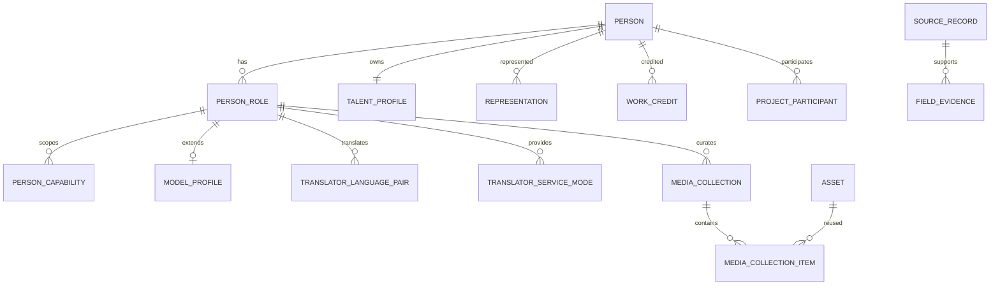

# ONCE Production OS｜Talent Domain 2.0

版本：v0.4｜日期：2026-09-26｜状态：规格冻结候选，尚未实现

## 1. 目的

Talent Domain 2.0 解决一个核心问题：ONCE 管理的不是“模特表、摄影师表、翻译表、剪辑师表”，而是现实中的同一个人，以及这个人拥有的职业身份、能力、作品、媒体、项目关系和资料证据。

本升级不重写 Asset、Work、Project、Source、Shortlist 等已存在领域，也不建立人才市场、CRM、报价、合同或排期。目标是让人才底座能够长期承载模特、演员、KOL、摄影、摄像、导演、剪辑、化妆、造型、翻译等角色，并为后续 Agent/AI 提供稳定、可验证的写入契约。

## 2. 冻结原则

1. **一个现实人物只有一个 Person。** 一个人有多个职业时增加 PersonRole，不复制 Person。
2. **Role 表达“是什么”，Capability 表达“会什么”。** 不创建“工业摄影师、汽车摄影师、产品摄影师”等爆炸式角色字典。
3. **通用事实只存一份。** 城市、服务地区、语言、联系信息、来源、维护状态属于人物通用层。
4. **专属结构按业务必要性增加，不按职业数量增加。** 首批只有 Model 需要完整专属结构；Translator 使用语言对/服务模式；Creative/Crew 首版主要使用 Role + Capability + Work。
5. **作品经历不是大段文本。** 外部履历继续使用 Work + WorkCredit；ONCE 实际合作继续使用 Project + ProjectParticipant。
6. **文件不是作品，媒体集合也不是作品。** Asset 表示逻辑文件；MediaCollection 只组织展示；Work 表示真实作品/项目成果。
7. **同一 Asset 可被多处引用但物理只存一份。** 可同时属于作品、人才 Portfolio、Shortlist 等。
8. **事实必须可追溯。** 专属字段、能力、代表关系均能关联 Source/FieldEvidence；AI/Agent 推断不能自动升级为事实。
9. **Agent 服从 OS Schema。** 外部 Agent 不得自造字段名、枚举或结构；先读取 schemaVersion，再按允许字段写入。
10. **旧 ID 不变。** 升级不得重新创建 Person、Work、Project、Asset 来换结构。

## 3. 目标关系

## 4. 通用人物层

### Person

Person 只表示现实中的人和生命周期，不承担职业专属字段。

保留：稳定 ID、展示名、别名、维护人、scope、主来源、状态、revision、protectionEpoch。

逐步移出 Person：`roles[]`、`skillCodes[]`、`heightCm`。这些是当前实现的过渡字段，不是 Talent 2.0 的最终结构。

### TalentProfile

所有人才共享的资料：

- cityCode；
- serviceAreaCodes；
- languageCodes；
- 通用简介引用/内部说明；
- 最后资料核验时间；
- 需要时的通用状态，不保存职业专属尺寸。

联系方式继续由 Contact/ContactMethod 管理，不复制到 TalentProfile。

## 5. 职业与能力

### PersonRole

一人多角色，每个 `personId + roleCode` 唯一。建议字段：

- id；
- personId；
- roleCode；
- status；
- sourceId；
- revision；
- createdAt / updatedAt。

首批 roleCode 可包含 MODEL、ACTOR、KOL、PHOTOGRAPHER、VIDEOGRAPHER、DIRECTOR、EDITOR、COLORIST、MAKEUP_ARTIST、STYLIST、TRANSLATOR、PRODUCER、LIGHTING、DRONE_OPERATOR 等，但新增 code 不等于必须新增数据库表。

### PersonCapability

Capability 表示可检索能力，不等同职业。字段：

- personId；
- personRoleId 可空：空表示通用能力，非空表示该职业下能力；
- capabilityCode；
- levelCode 可空；
- sourceId；
- revision。

约束：指定 personRoleId 时必须属于同一 Person；同一作用域内 `capabilityCode` 唯一。

例：Photographer + INDUSTRIAL / PRODUCT / FASHION；Editor + COLOR_GRADING / MOTION_GRAPHICS；Model + RUNWAY / LINGERIE；Translator + CONSECUTIVE_INTERPRETATION。

现有 `skillCodes[]` 迁移为 PersonCapability 的 GENERAL 记录，不猜测属于哪个 Role。

## 6. 专属职业资料

### ModelProfile

Model 是首批完整专属结构，按 PersonRole 扩展，一条 MODEL Role 最多一条 ModelProfile。

建议结构化字段：

- heightCm；
- bustCm / waistCm / hipsCm；
- clothingSizeCode；
- shoeSize；
- hairColorCode；
- eyeColorCode；
- measuredOn；
- profileRevision。

尺寸未知为 null，不以 0 代替；单位固定/显式。字段是否需要业务采集由实际用途决定，不默认收身份证、护照、家庭地址、健康等无关敏感资料。

当前 `Person.heightCm` 只有在该 Person 已明确拥有 MODEL Role 时才能自动迁入 ModelProfile；否则保留为待人工映射的 legacy fact，禁止根据“有身高字段”推断其是模特。

### Translator Profile（逻辑资料卡）

首版不建一个万能 Translator JSON。翻译资料卡由以下事实组合：

- TRANSLATOR PersonRole；
- common languageCodes；
- TranslatorLanguagePair；
- TranslatorServiceMode；
- PersonCapability（专业领域）；
- Work / WorkCredit；
- 来源与核验。

`translator_language_pair`：personRoleId、sourceLanguageCode、targetLanguageCode、sourceId、revision。

`translator_service_mode`：personRoleId、modeCode、sourceId、revision。modeCode 例如 BUSINESS_MEETING、ON_SET、ESCORT、CONSECUTIVE、SIMULTANEOUS、WRITTEN。

### Creative / Crew

摄影、摄像、导演、剪辑、调色、灯光、化妆、造型等首版不建立一职业一张 profile 表。优先使用：

`PersonRole + PersonCapability + WorkCredit + ProjectParticipant + MediaCollection`

只有真实业务反复出现“必须结构化筛选、存在稳定校验规则、无法用 Capability/Work 表达”的字段时，才新增专属扩展表并做前向迁移。

## 7. Representation

经纪人、Agency、booking contact 不能只写在备注。

Representation 建议字段：

- representedPersonId；
- agencyOrganizationId 可空；
- agentPersonId 可空；
- relationCode；
- sourceId；
- validFrom / validUntil 可空；
- status；
- revision。

agencyOrganizationId 与 agentPersonId 至少一个存在；Agent Person 不因此变成被代理人的登录账号。历史关系可过期但不覆盖旧记录。

## 8. MediaCollection

Asset 继续表示逻辑媒体文件；MediaCollection 是人才职业资料中的“组织方式”。

字段：

- id；
- personRoleId；
- collectionTypeCode；
- title；
- status；
- revision。

MediaCollectionItem：

- collectionId；
- assetId；
- orderIndex；
- caption 可空；
- featured；
- revision。

首批 collectionTypeCode：

- MODEL_CARD
- POLAROIDS
- PORTFOLIO
- FASHION
- BEAUTY
- COMMERCIAL
- LINGERIE
- RUNWAY
- SHOWREEL
- INTRO_VIDEO
- OTHER

同一 Asset 可加入多个集合、Work 或 Shortlist；不得复制物理文件来实现不同分类。MediaCollection 不能替代 Work：SHEIN Campaign 仍是 Work，Anna 的 Lingerie Portfolio 是 Collection。

底层 PDF/MP4 封存与安全预览仍属于 media 域；Talent 2.0 只定义如何引用与组织，不重新实现存储。

## 9. 外部作品与 ONCE 项目

继续保持现有边界：

- External Work：人才自带履历、品牌拍摄、走秀等；
- ONCE Work / Project：ONCE 实际参与和交付；
- WorkCredit：人在作品中的真实署名；
- ProjectParticipant：人在 ONCE 项目中的真实参与事实。

“Worked with SHEIN / L'Oréal”不得只存为逗号分隔文本后用于统计，也不得自动算成 ONCE 客户或 ONCE 项目。

## 10. Evidence 扩展

FieldEvidence 必须能覆盖 Talent 2.0 的事实目标。实现时使用受约束的类型化 owner，不允许自由字符串指向任意对象。

至少支持：

- Person / TalentProfile；
- PersonRole；
- ModelProfile；
- PersonCapability；
- TranslatorLanguagePair / TranslatorServiceMode；
- Representation。

若采用一张 evidence 表，目标 FK 列必须通过数据库 CHECK 保证 exactly-one；若拆表，也必须保持统一查询语义。旧证据不得因迁移而改写为“新核验”。

## 11. Search 2.0

结构化搜索按事实组合，不做未经校准的“匹配分”。

必须支持：

- Role；
- Capability；
- city / service area；
- language；
- Work industry / type；
- ONCE actual cooperation；
- MediaCollection 是否存在；
- 核验新鲜度；
- 对 ModelProfile 的明确业务字段筛选（只有获准且有必要的字段）。

例：

“深圳 + Model + Lingerie + English + 有相关作品”

不是一个 `modelType` 字符串，而是 Role + Capability + language + location + Work 的组合。

“工业制造摄影师”不是新 Role，而是 PHOTOGRAPHER + INDUSTRIAL capability + 对应 Work evidence。

## 12. Agent / API 契约

Talent 2.0 完成后才能冻结 Agent 写入契约。MCP、Skills、API 只是适配层，不拥有另一套人才模型。

服务端提供版本化 Talent Schema 只读能力，至少返回：

- schemaVersion；
- role definitions；
- capability namespaces；
- 某 Role 允许的专属字段；
- 字段类型、单位、枚举、是否可空；
- evidence/source 要求；
- 当前废弃字段。

Agent 写入要求：

1. 先按稳定标识查找 Person，不能按姓名自动合并；
2. 使用已注册 Role/Capability code；
3. 未知字段直接拒绝，不能落入自由 JSON；
4. 写事实必须携带来源或进入待确认流程；
5. expectedRevision / idempotency / scope 继续执行；
6. Agent/AI 建议与人工确认后的业务事实分离。

## 13. 前向迁移策略

Talent 2.0 只做追加式前向迁移，不改写历史 migration。

建议顺序：

1. 新增 PersonRole、TalentProfile、PersonCapability 及组合约束；
2. 从 Person.roles 回填 PersonRole；未知 code 生成迁移报告，不静默丢弃；
3. 从 languageCodes 回填/保持 TalentProfile；
4. 从 skillCodes 回填 GENERAL PersonCapability，不猜 Role；
5. 新增 ModelProfile；仅对已有 MODEL Role 的 heightCm 自动映射；
6. 新增 Representation、MediaCollection、Translator 子关系；
7. 双读验证旧/新查询结果；
8. 新写只写 Talent 2.0；
9. 旧 `roles[] / skillCodes[] / heightCm` 进入只读兼容期；
10. 所有不一致清零并完成回滚/恢复验证后，另一个前向 migration 删除旧列。

整个过程 Person/Work/Project/Asset UUID 保持不变。

## 14. 首批验收

Talent 2.0 Gate 至少包含：

- 同一 Person 同时 MODEL + ACTOR + KOL，始终只有一个 Person ID；
- 同人重复添加同 role 被唯一约束拒绝；
- MODEL Role 能保存/更新 ModelProfile，非 MODEL Role 不能挂 ModelProfile；
- 旧 heightCm 无 MODEL Role 时不会被自动转成 ModelProfile；
- Photographer 不需要专属表即可通过 Role + Capability + Work 被检索；
- Translator 可按语言对 + 服务模式筛选；
- skillCodes 迁移后不丢失且不被猜到某个 Role；
- 同一 Asset 同时进入 Portfolio、Work、Shortlist 时物理对象仍只有一份；
- 外部 Work 不增加 ONCE 项目或“已合作”事实；
- Representation 有来源、时间范围且不会覆盖历史；
- 受限字段在列表、facet、导出、AI/Agent 输入中保持同样权限；
- Agent 使用未知 field/capability/schemaVersion 被明确拒绝；
- 迁移前后 Person/Work/Project/Asset 稳定 ID 与关系不变；
- 旧库升级、新空库、JSON rebuild、备份恢复路径均包含新模型。

## 15. 实施顺序

在当前 DEV-09 恢复链完成后、DEV-08 AI 开始前执行：

- TD2-01：统一 PersonRole / TalentProfile / Capability + 迁移兼容；
- TD2-02：ModelProfile + Evidence 扩展；
- TD2-03：Representation + MediaCollection；
- TD2-04：Translator 语言对/服务模式 + Creative/Crew 验证；
- TD2-05：Search 2.0 / Shortlist / 导出 / rebuild / recovery 接线；
- TD2-06：Talent Schema / Agent Contract + 完整 Gate。

TD2-06 全部验收前，不允许 DEV-08 的 extract_profile / suggest_tags / parse_search 以旧的 Person.roles/skillCodes/heightCm 契约固化新数据。

## 16. 明确不做

本升级不做：

- 每职业一套独立人才库；
- 为未来几十种职业预建空 profile 表；
- 无约束 JSON/EAV 代替核心可查询事实；
- CRM、报价、合同、排期、财务；
- 客户/人才自助门户；
- MCP/Skills 的具体产品 UI；
- AI 自动认可事实；
- 根据照片推断国籍、年龄、健康、宗教等敏感事实。

Talent Domain 2.0 的完成标准不是“字段更多”，而是 ONCE 能用一套稳定事实模型承载不同制作人才，并且后续 Agent/AI 不需要再发明第二套结构。
